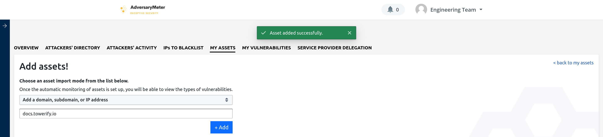
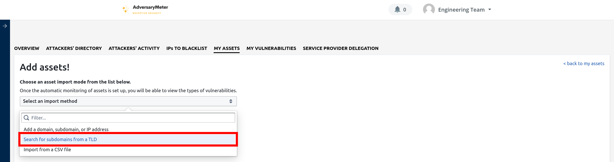
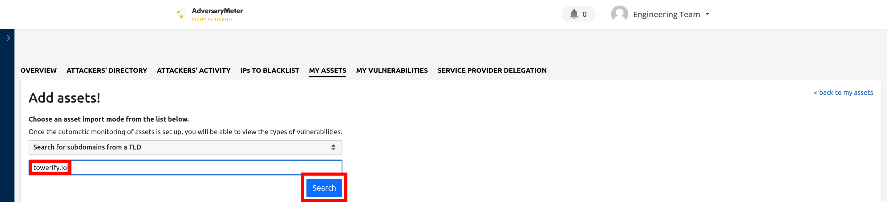
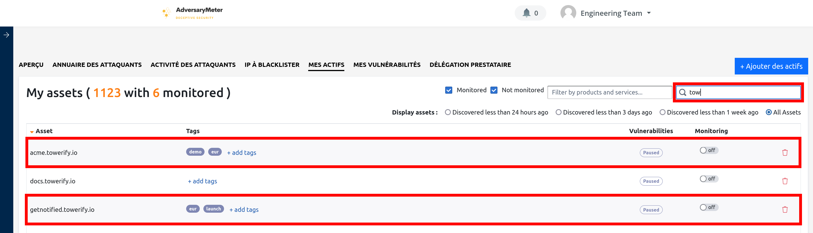
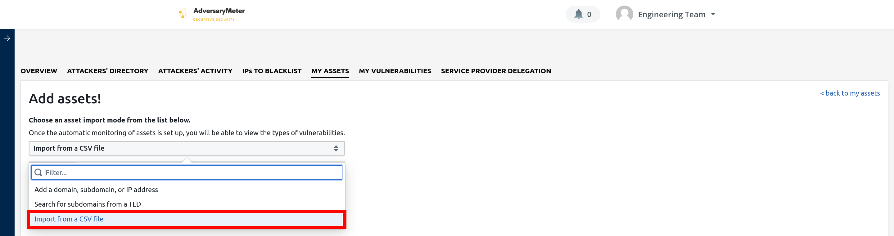
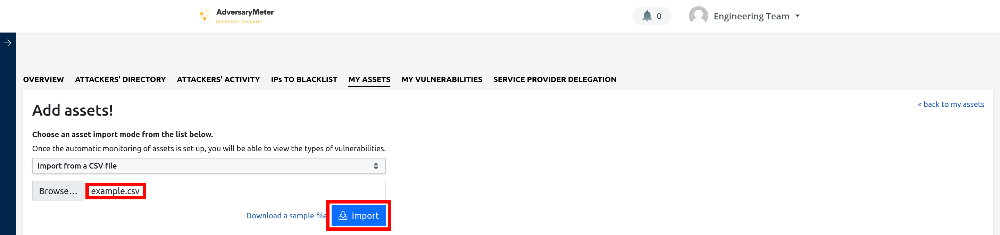

# Actifs

Un _actif_ représente une adresse IP, une plage d'adresses IP ou un DNS vous appartenant.

## Mes actifs

L'onglet "Mes actifs" regroupe l'ensemble des actifs d'une organisation. Il permet d'ajouter ou supprimer des actifs
ainsi que de démarrer ou d'arrêter la surveillance d'un actif.

1. Permet de filtrer la liste des actifs : par statut (surveillé / à surveiller), par type de produit ou de service
   exposé sur internet, en plein texte.

2. Toutes les nuits, un processus de découverte automatique recherche activement de nouvelles adresses IP ou de nouveaux
   domaines appartenant à l'organisation. Les actifs découverts sont ajoutés automatiquement à la liste des actifs d'une
   organisation. Cependant, ceux-ci ne sont pas surveillés automatiquement. Cet ensemble de filtres permet de
   retrouver les derniers actifs découverts par AdversaryMeter.

3. Actifs de l'organisation.

4. Etiquettes permettant de regrouper les actifs d'une organisation. Ces étiquettes permettent notamment la création
   d'une ou plusieurs "Cyber TODO" dans le cadre de délégations de service.

5. Aperçu rapide du nombre et du niveau de criticité des vulnérabilités impactant un actif.

6. Permet de démarrer ou d'arrêter la surveillance d'un actif.

7. Permet de relancer le scan d'un actif sans attendre scan le prochain scan automatique.

8. Permet d'afficher la "carte d'identité" d'un actif ou de supprimer ce dernier. Cette "carte d'identité" contient de
   nombreuses informations dont la liste des vulnérabilités impactant cet actif, la liste des ports ouverts et des
   technologies exposées, le statut du scan, etc. Il est important de noter qu'un actif surveillé ne peut pas être
   supprimé.

9. Permet de parcourir la liste des actifs.

## Ajouter un actif

Il est possible d'importer de nouveaux actifs de trois manières différentes :

- via un ajout manuel
- via une recherche de sous-domaine
- via un import CSV

!!! warning "Bon à savoir..."

    Les actifs ajoutés __ne sont pas__ automatiquement mis sous surveillance! La mise sous surveillance d'un actif est 
    une action à réaliser manuellement.

### Ajout manuel

Pour ajouter manuellement un actif :

- Sélectionner l'onglet "Mes actifs" puis cliquer sur le bouton "+ Ajouter un actif" en haut à droite de l'écran :
  
- Dans la liste déroulante, sélectionner l'option "Ajouter un domaine, un sous-domaine ou une adresse IP"
  
- Saisir le domaine, le sous-domaine ou l'adresses IP que vous souhaitez ajouter à la liste de vos actifs puis cliquer
  sur le bouton "+ Ajouter"
  
- En cas de succès, une notification s'affiche à l'écran. Il vous est alors possible d'ajouter un autre domaine ou de
  revenir à la liste de vos actifs en cliquant sur le lien "< revenir à mes actifs" en haut à droite de l'écran
  
- L'actif ajouter est maintenant visible dans la liste de vos actifs
  

### Recherche de sous-domaine

Pour rechercher un sous-domaine à partir d'un domaine racine :

- Sélectionner l'onglet "Mes actifs" puis cliquer sur le bouton "+ Ajouter un actif" en haut à droite de l'écran :
  
- Dans la liste déroulante, sélectionner l'option "Rechercher des sous-domaines à partir d'un TLD"
  
- Saisir le domaine racine que vous souhaitez énumérer puis cliquer sur le bouton "Rechercher"
  
- Après quelques instants de recherche (de 30s à 1mn), une liste de sous-domaines du domaine racine apparaît. Vous
  pouvez alors sélectionner le ou les domaines à importer puis cliquer sur le bouton "+ Ajouter" en bas à droite de
  l'écran pour ajouter ceux-ci à la liste de vos actifs. Si vous souhaitez importer l'ensemble des sous-domaines d'un
  coup, cocher la case située en haut à droite dans l'en-tête du tableau.
  
- En cas de succès, vous serez automatiquement redirigé vers la liste de vos actifs. Les actifs ajoutés sont maintenant
  visibles dans cette liste.
  

### Import CSV

L'import CSV permet d'importer plusieurs milliers d'actifs d'un coup. De plus, l'import CSV rend possible l'ajout en
masse d'__étiquettes__ :

- Sélectionner l'onglet "Mes actifs" puis cliquer sur le bouton "+ Ajouter un actif" en haut à droite de l'écran :
  
- Dans la liste déroulante, sélectionner l'option "Importer un fichier CSV"
  
- Vous pouvez ensuite télécharger le modèle de fichier CSV proposé et remplir celui-ci. La première colonne du fichier
  DOIT contenir la liste des domaines, sous-domaines ou adresses IP à importer. La seconde colonne PEUT contenir des
  étiquettes (séparées par un `|`) à ajouter automatiquement aux actifs importés.
  
  
- Une fois le modèle remplit, il ne reste plus qu'à téléverser celui-ci en cliquant sur le bouton "Importer"
  
- Une prévisualisation du fichier est alors proposée pour vous permettre d'en vérifier le contenu. Sélectionner
  l'ensemble des actifs en cochant la case située en haut à droite dans l'en-tête du tableau. Cliquer sur le bouton "+
  Ajouter" en bas à droite de l'écran pour lancer le processus d'import.
  
- En cas de succès, vous serez automatiquement redirigé vers la liste de vos actifs. Les actifs ajoutés sont maintenant
  visibles dans cette liste.
  
