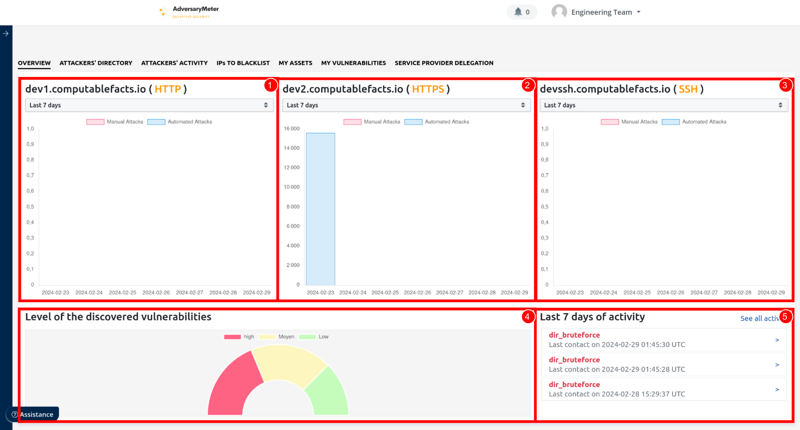

# Tableau de bord

La page d'accueil d'AdversaryMeter offre une vue consolidée et en temps réel de la posture de sécurité d'une
organisation.

1. Offre une vision synthétique du nombre d'attaques automatisées et manuelles ayant eu lieu sur le _honeypot HTTP_ sur
   une période de temps donnée : 7 jours, 14 jours ou 30 jours glissant.

2. Offre une vision synthétique du nombre d'attaques automatisées et manuelles ayant eu lieu sur le _honeypot HTTPS_ sur
   une période de temps donnée : 7 jours, 14 jours ou 30 jours glissant.

3. Offre une vision synthétique du nombre d'attaques automatisées et manuelles ayant eu lieu sur le _honeypot SSH_ sur
   une période de temps donnée : 7 jours, 14 jours ou 30 jours glissant.

4. Offre une vision synthétique de la répartition des vulnérabilités en fonction de leur criticité.

5. Affiche les derniers événements captés par les différents honeypots.