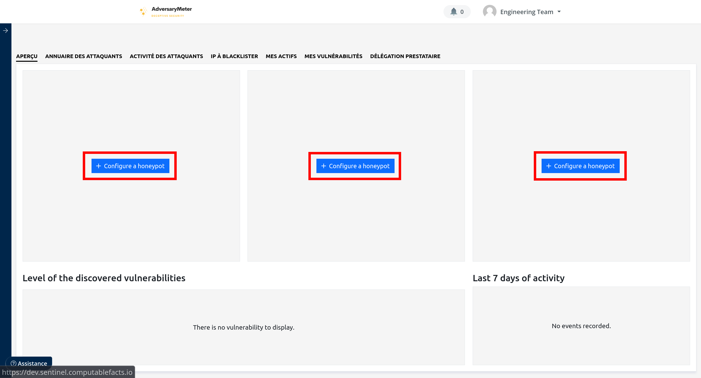
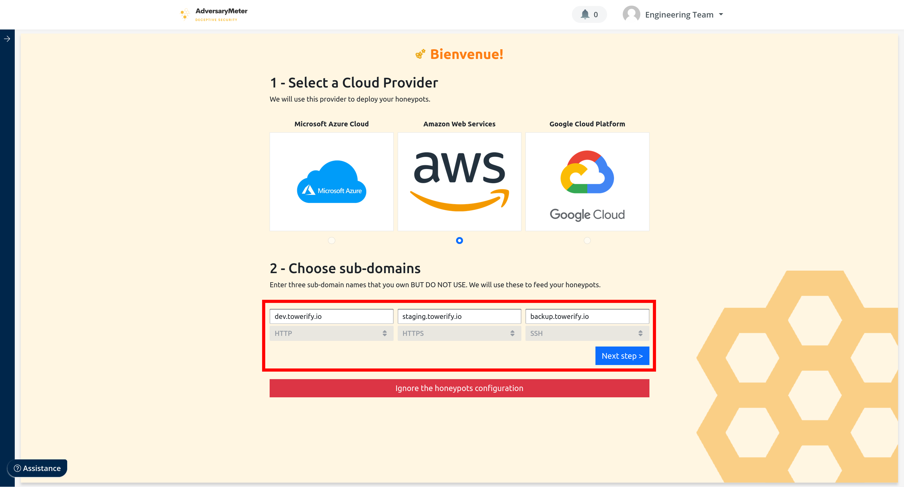
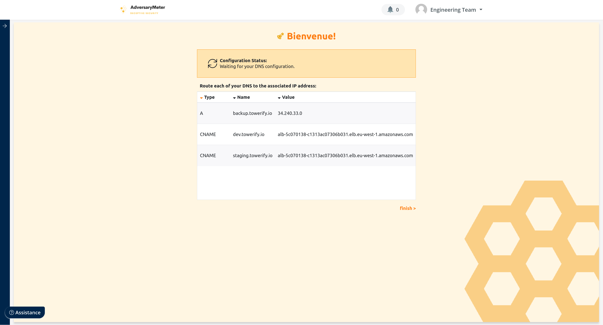
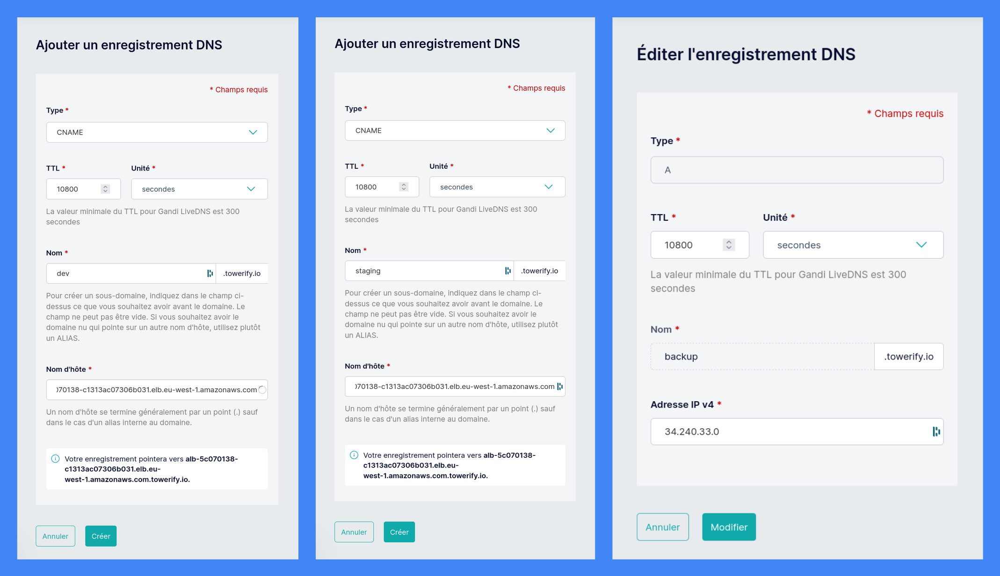
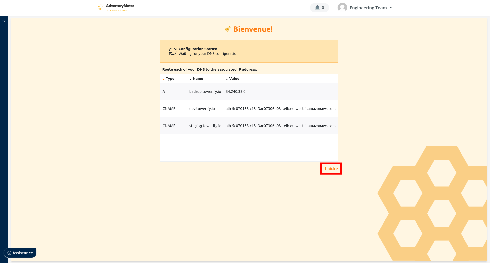
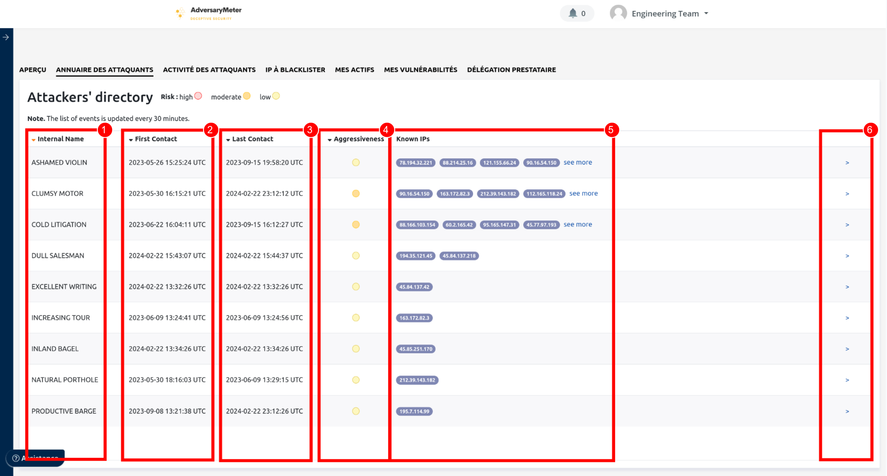

# Honeypots

Les _honeypots_ déployés par AdversaryMeter ont pour objectif de catégoriser :

- __Les attaques :__ manuelles vs automatisées, ciblées vs aléatoires, persistantes vs changeantes ;
- __Les attaquants :__ création de profils, suivi de l’activité, évaluation du niveau.

Ils ont été spécialement conçus pour être attractifs aux yeux d'attaquants humains. Les honeypots sont créés par groupe
de trois : un pour le protocole HTTP, un pour le protocole HTTPS et un pour le protocole SSH.

## Configuration des honeypots

Pour créer des honeypots :

1. Afficher le tableau de bord puis cliquer sur un des boutons "+ Configurer un honeypot" :
   

2. Choisir trois noms de domaines ou de sous-domaines __vous appartenant mais non utilisés__. Saisir ces noms de
   domaines ou de sous-domaines au-dessus du protocole désiré. Cliquer ensuite sur le bouton "étape suivante" pour
   continuer la configuration des honeypots.
   

3. Après quelques instants, les informations à ajouter à votre configuration DNS s'affichent :
   

4. Connectez-vous à la console d'administration de votre fournisseur de noms de domaines et configurez les DNS choisis
   précédemment en utilisant les informations affichées à l'écran.
   

5. Une fois la configuration DNS terminée, cliquer sur le bouton "terminer >" situé en bas à droite de l'écran :
   

6. La création des honeypots est alors lancée. En attendant que ceux-ci soient pleinement opérationnels, vous pouvez
   cliquer sur le bouton "Accéder au tableau de bord" et continuer à utiliser AdversaryMeter pour surveiller vos actifs.
   

## Profils des Attaquants

Quand un attaquant humain est détecté, un _profil d'attaquant_ est automatiquement créé. Ce profil regroupera l'ensemble
des événements générés par cet attaquant pour être à même d'en mesurer l'impact sur les [actifs](assets.md) de
l'organisation.

1. Nom de code de l'attaquant. Ce nom de code est généré automatiquement.

2. Date de premier contact avec l'attaquant. Lorsqu'un profil d'attaquant est créé, AdversaryMeter examine
   les événements passés pour rattacher automatiquement à cet attaquant des événements pouvant très probablement lui
   être imputés. La date de premier contact peut donc être antérieure à la date de création du profil.

3. Date de dernier contact avec l'attaquant. Cette date correspond au dernier événement connu généré par cet attaquant.

4. Agressivité de l'attaquant. Cet indicateur tient aussi bien compte de la quantité d'événements générés par
   l'attaquant que de l'espacement temporel entre ceux-ci ou encore de l'impact qu'aurait son attaque si celle-ci était
   rejouée sur les actifs de l'organisation. C'est une mesure du risque que l'attaquant fait _actuellement_ peser sur 
   l'organisation. Cela peut permettre, par exemple, d'ajuster vos blacklists en fonction de ce paramètre au bien 
   d'augmenter l'état d'alerte de votre équipe sécurité dans le cas où le nombre d'attaquants agressifs est supérieur à 
   une baseline.

5. Liste d'adresses IP pouvant être associées à l'attaquant.

6. Permet d'accéder au profil complet de l'attaquant.