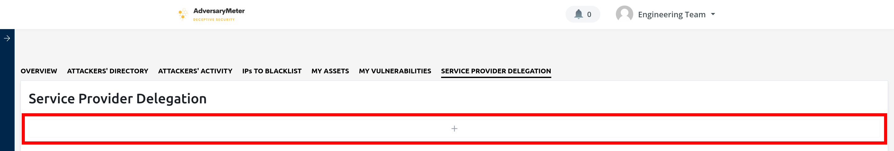
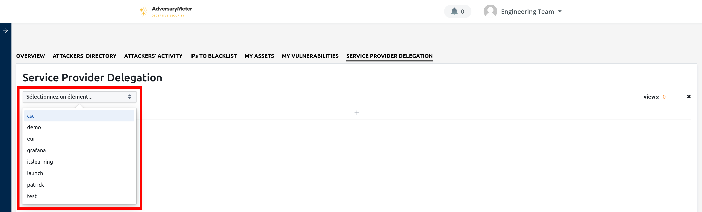
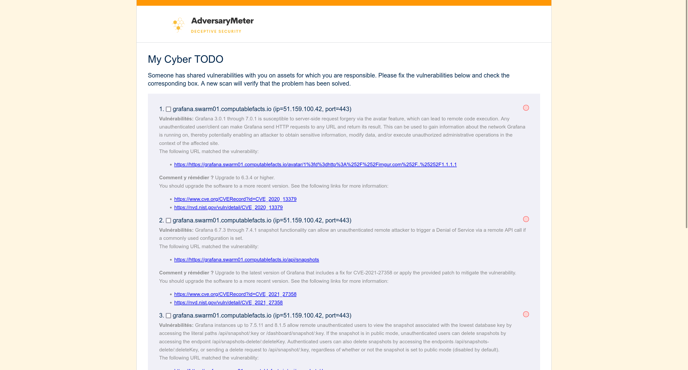

# Délégation prestataire

Cette fonctionnalité facilite la création d'une liste de tâches ciblée, ou "Cyber TODO", comprenant l'ensemble des
actifs nécessitant une attention particulière. Une fois cette liste établie, celle-ci peut être facilement partagée avec
un prestataire externe de services informatiques ou de cybersécurité. Cela permet une collaboration efficace et ciblée,
où le prestataire a une vision claire de son périmètre d'actions à réaliser, optimisant ainsi les efforts de
sécurisation et de maintenance du système informatique de l'organisation.

Pour créer une "Cyber TODO" :

- Sélectionner l'onglet "Délégation prestataire" puis cliquer sur le bouton "+" placé au milieu de l'écran :
  
- Sélectionner ensuite une [étiquette](assets.md) dans la liste prévue à cet effet. Cette [étiquette](assets.md) sera
  utilisée pour regrouper ensemble les vulnérabilités associées à des actifs munis de celle-ci.
  
- Une fois l'étiquette sélectionnée, un lien est automatiquement généré vers une page web pouvant être partagée à un
  tiers.
  
