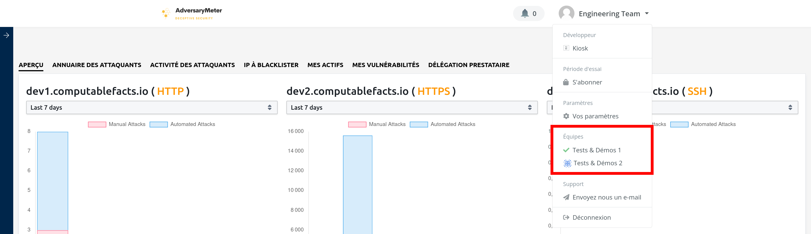
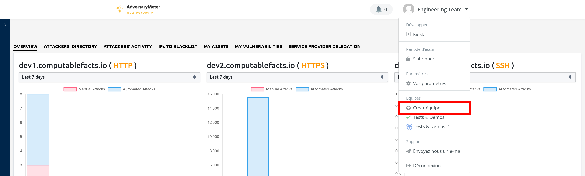
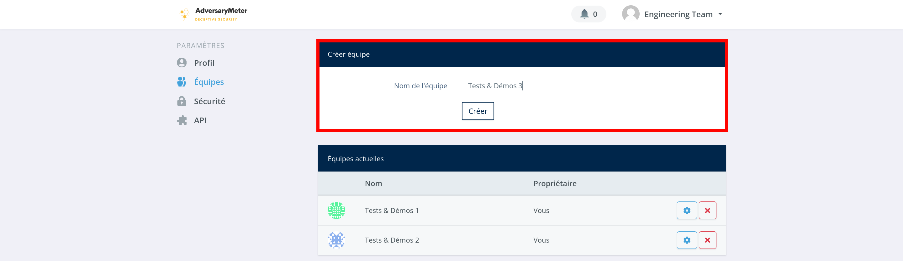
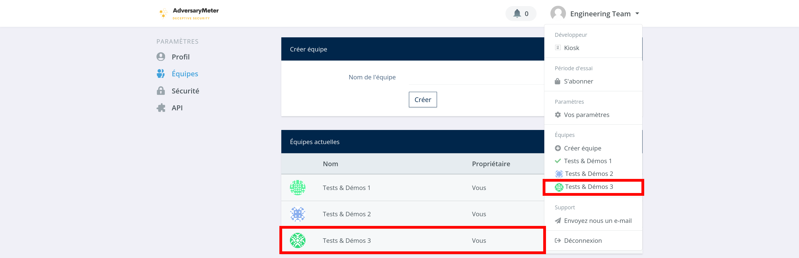
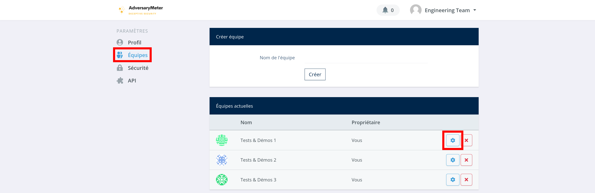
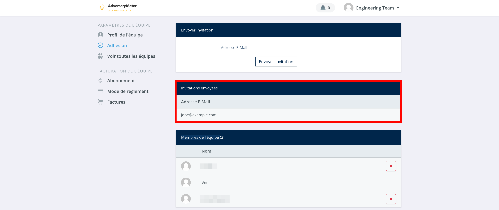
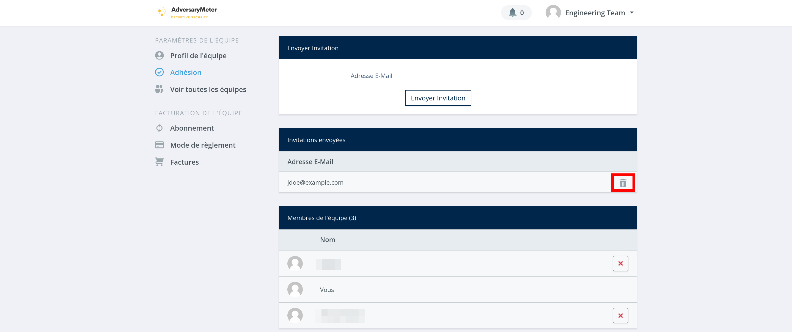

# Equipes

Une _équipe_ permet de fédérer des utilisateurs autours d'un ensemble d'actifs, i.e. des DNS ou des IPs, à surveiller.
Une équipe par défaut est automatiquement créée lors de l'activation de votre compte. Un même utilisateur peut
appartenir à une ou plusieurs équipes.

## Changement d'équipe

Pour afficher les actifs associés à une équipe, ouvrir le menu déroulant situé en haut à droite de l'écran. Sélectionner
ensuite l'équipe idoine. Les données affichées à l'écran sont alors mises à jour pour correspondre aux actifs associés à
l'équipe sélectionnée.

??? note "Bon à savoir..."

    Il n'est actuellement pas possible d'afficher dans l'interface utilisateur l'ensemble des actifs appartenant à 
    plusieurs équipes simultanément. Cependant, il est possible de configurer un dashboard Superset permettant cela. 
    Pour en savoir plus, contacter <a href="mailto:engineering@computablefacts.com">engineering@computablefacts.com</a>.

## Création d'équipe

Pour créer une équipe :

- Ouvrir le menu déroulant situé en haut à droite de l'écran puis sélectionner l'entrée de menu "Créer équipe"
  
- Saisir un nom d'équipe puis appuyer sur le bouton "Créer"
  
- Si la création réussit, une équipe est ajoutée à la liste des "Equipes actuelles" en bas de l'écran ainsi qu'au
  menu situé en haut à droite de l'écran
  

## Invitation d'utilisateur

Pour inviter un utilisateur à accéder aux données d'une équipe :

- Ouvrir le menu déroulant situé en haut à droite de l'écran puis sélectionner l'entrée de menu "Vos paramètres"
  
- Dans le menu de gauche, sélectionner l'entrée de menu "Equipes". Sélectionner ensuite l'équipe à laquelle vous
  souhaitez ajouter un utilisateur
  
- Dans le menu de gauche, sélectionner l'entrée de menu "Adhésions"
  
- Saisir l'email de l'utilisateur à inviter puis appuyer sur le bouton "Envoyer l'invitation"
  
- Si l'envoie de l'invitation réussit, un utilisateur est ajouté à la liste des "Invitations envoyées"
  
- Une fois l'invitation acceptée par l'utilisateur, son nom sera supprimé de la liste des "Invitations envoyées" pour
  être ajouté à la liste des "Membres de l'équipe"

## Annulation d'invitation

Pour annuler une invitation envoyée par erreur à un utilisateur :

- Ouvrir le menu déroulant situé en haut à droite de l'écran puis sélectionner l'entrée de menu "Vos paramètres"
  
- Dans le menu de gauche, sélectionner l'entrée de menu "Equipes". Sélectionner ensuite l'équipe à laquelle vous
  souhaitez ajouter un utilisateur
  
- Dans le menu de gauche, sélectionner l'entrée de menu "Adhésions"
  
- Dans la liste des "Invitations envoyées", sélectionner un utilisateur puis cliquer sur la "poubelle" qui apparaît à
  droite de son nom pour supprimer celui-ci
  

## Suppression d'utilisateur

Pour empêcher un utilisateur d'accéder aux données d'une équipe :

- Ouvrir le menu déroulant situé en haut à droite de l'écran puis sélectionner l'entrée de menu "Vos paramètres"
  
- Dans le menu de gauche, sélectionner l'entrée de menu "Equipes". Sélectionner ensuite l'équipe à laquelle vous
  souhaitez ajouter un utilisateur
  
- Dans le menu de gauche, sélectionner l'entrée de menu "Adhésions"
  
- Dans la liste des "Membres de l'équipe", appuyer sur la croix rouge pour révoquer l'accès aux données de l'équipe à
  l'utilisateur
  
