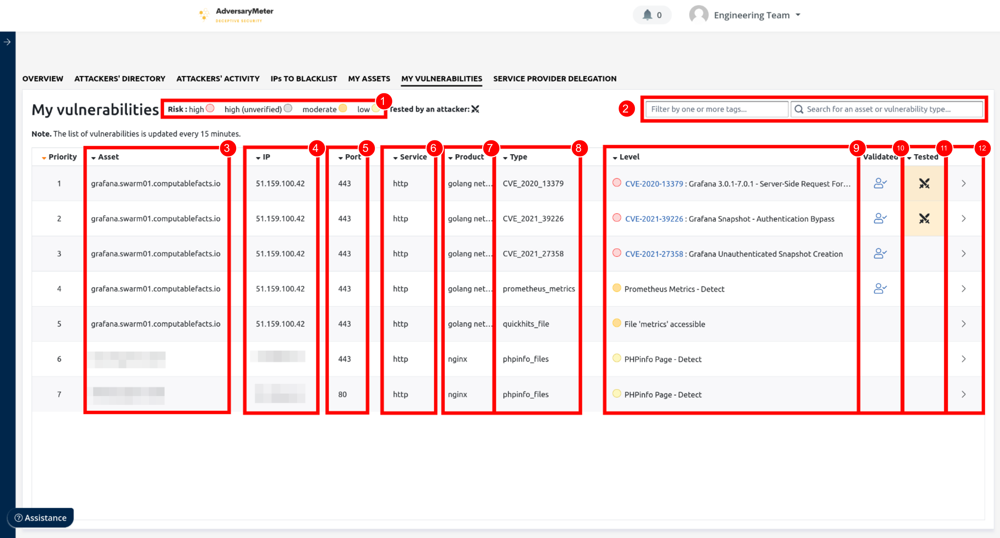

# Vulnérabilités

Une _vulnérabilité_ représente une faiblesse d'un serveur ou d'une application pouvant être exploitée par un attaquant.
L'exploitation d'une vulnérabilité peut permettre à un attaquant d'accéder à des données sensibles, de prendre le
contrôle du système affecté, d'introduire des logiciels malveillants, ou de perturber les services fournis.

## Mes vulnérabilités

L'onglet "Mes vulnérabilités" regroupe l'ensemble des vulnérabilités impactant les actifs d'une organisation. Ces
vulnérabilités sont triées en fonction de leur niveau de criticité.

1. Permet de filtrer la liste des vulnérabilités par criticité.

2. Permet de filtrer la liste des vulnérabilités en fonction d'étiquettes ajoutées automatiquement par AdversaryMeter
   lors du scan d'un actif ou encore au moyen d'une recherche plein texte.

3. Actifs de l'organisation impactés par une vulnérabilité.

4. Dans le cas où l'actif vulnérable est un DNS, IP trouvée après résolution DNS.

5. Port impacté par la vulnérabilité.

6. Service exposé sur le port impacté.

7. Produit à l'origine du service exposé.

8. Type de vulnérabilité détecté.

9. Niveau de criticité de la vulnérabilité et descriptif court de celle-ci.

10. Le picto indique l'existence d'une entrée dans la base de connaissance de l'organisation.

11. Le picto indique que la vulnérabilité a été exploitée sur un des honeypots de l'organisation.

12. Permet d'afficher la "[carte d'identité](assets.md#carte-didentite-dun-actif)" de l'actif concerné.

## Délégation prestataire

Cette fonctionnalité facilite la création d'une liste de tâches ciblée, ou "Cyber TODO", qui comprend tous les actifs
nécessitant une attention particulière. Une fois cette liste établie, elle peut être facilement partagée avec un
prestataire externe de services informatiques ou de cybersécurité. Cela permet une collaboration efficace et ciblée,
où le prestataire a une vision claire de son périmètre d'actions à réaliser, optimisant ainsi les efforts de
sécurisation et de maintenance du système informatique de l'organisation.

Pour créer une "Cyber TODO" :

- Sélectionner l'onglet "Délégation prestataire" puis cliquer sur le bouton "+" placé au milieu de l'écran :
  
- Sélectionner ensuite une [étiquette](assets.md) dans la liste prévue à cet effet. Cette étiquette sera utilisée pour
  regrouper ensemble les vulnérabilités associées aux actifs munis de celle-ci.
  
- Une fois l'étiquette sélectionnée, un lien est automatiquement généré vers une liste des vulnérabilités pouvant être
  partagée à des tiers.
  
