# Workflows

## Equipes

Une _équipe_ permet de fédérer des utilisateurs autours d'un ensemble d'actifs, i.e. des DNS ou des IPs, à surveiller.
Une équipe par défaut est automatiquement créée lors de l'activation de votre compte. Un même utilisateur peut
appartenir à une ou plusieurs équipes.

### Changement d'équipe

Pour afficher les actifs associés à une équipe, ouvrir le menu déroulant situé en haut à droite de l'écran. Sélectionner
ensuite l'équipe idoine. Les données affichées à l'écran sont alors mises à jour pour correspondre aux actifs associés à
l'équipe sélectionnée.

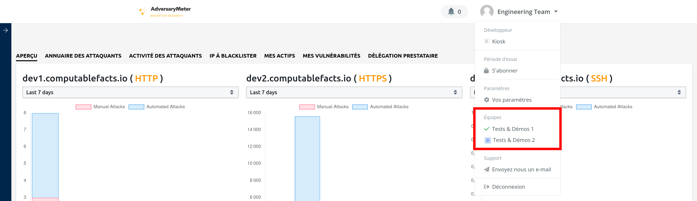

??? note "Bon à savoir..."

    Il n'est actuellement pas possible d'afficher dans l'interface utilisateur l'ensemble des actifs appartenant à 
    plusieurs équipes simultanément. Cependant, il est possible de configurer un dashboard Superset permettant cela. 
    Pour en savoir plus, contacter <a href="mailto:engineering@computablefacts.com">engineering@computablefacts.com</a>.

### Création d'équipe

Pour créer une équipe :

- Ouvrir le menu déroulant situé en haut à droite de l'écran puis sélectionner l'entrée de menu "Créer équipe"
  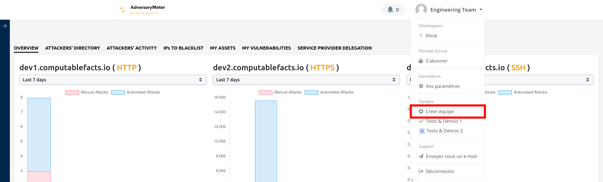
- Saisir un nom d'équipe puis appuyer sur le bouton "Créer"
  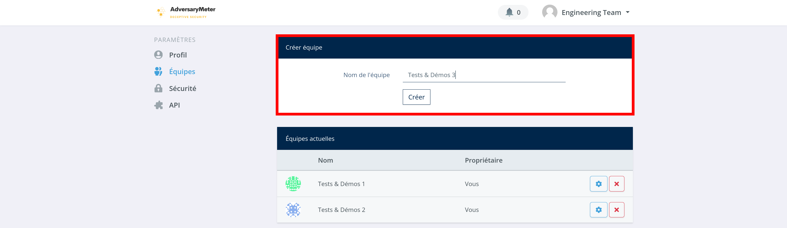
- Si la création réussit, une équipe est ajoutée à la liste des "Equipes actuelles" en bas de l'écran ainsi qu'au
  menu situé en haut à droite de l'écran
  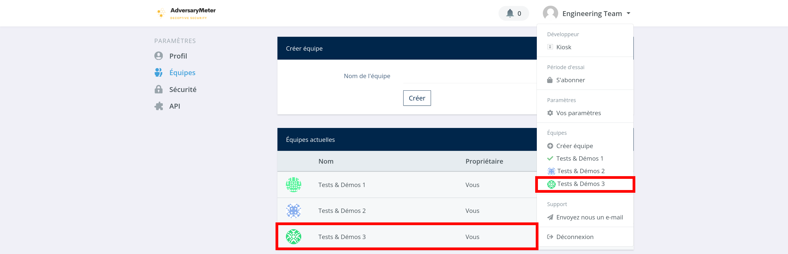

### Invitation d'utilisateur

Pour inviter un utilisateur à accéder aux données d'une équipe :

- Ouvrir le menu déroulant situé en haut à droite de l'écran puis sélectionner l'entrée de menu "Vos paramètres"
  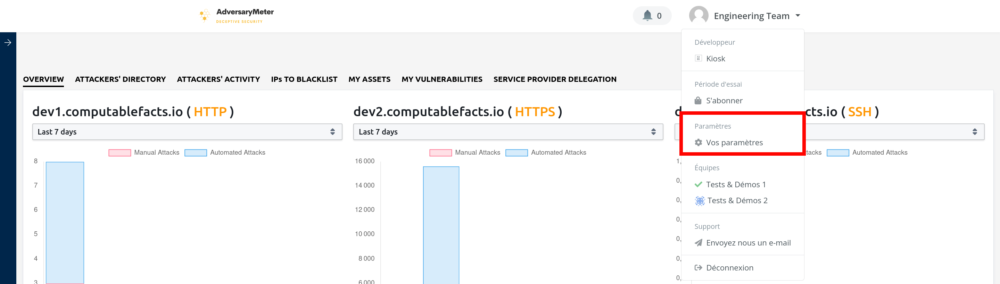
- Dans le menu de gauche, sélectionner l'entrée de menu "Equipes". Sélectionner ensuite l'équipe à laquelle vous
  souhaitez ajouter un utilisateur
  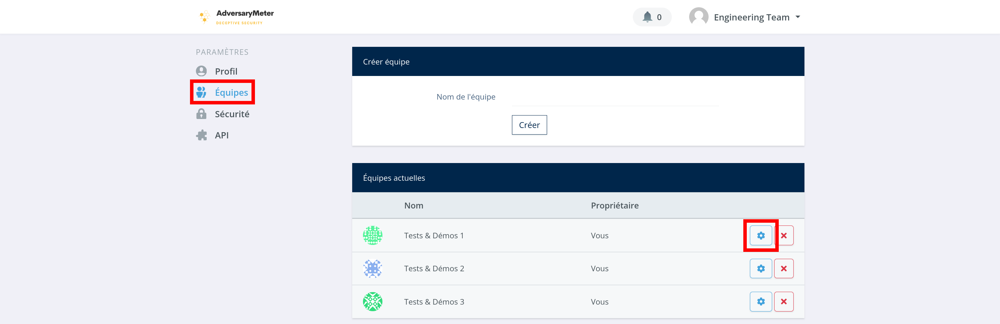
- Dans le menu de gauche, sélectionner l'entrée de menu "Adhésions"
  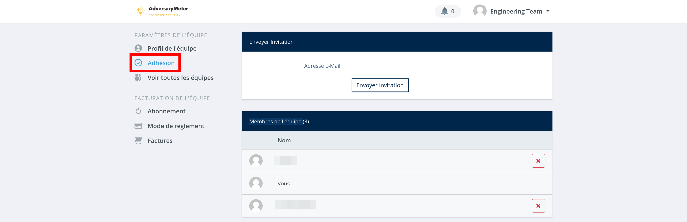
- Saisir l'email de l'utilisateur à inviter puis appuyer sur le bouton "Envoyer l'invitation"
  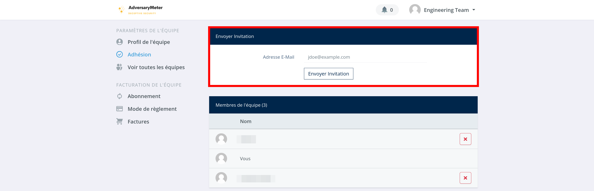
- Si l'envoie de l'invitation réussit, un utilisateur est ajouté à la liste des "Invitations envoyées"
  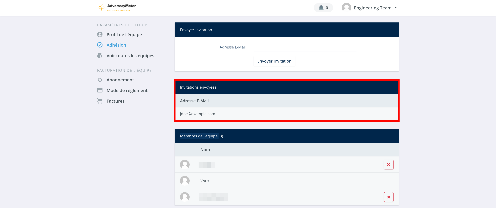
- Une fois l'invitation acceptée par l'utilisateur, son nom sera supprimé de la liste des "Invitations envoyées" pour
  être ajouté à la liste des "Membres de l'équipe"

### Annulation d'invitation

Pour annuler une invitation envoyée par erreur à un utilisateur :

- Ouvrir le menu déroulant situé en haut à droite de l'écran puis sélectionner l'entrée de menu "Vos paramètres"
  
- Dans le menu de gauche, sélectionner l'entrée de menu "Equipes". Sélectionner ensuite l'équipe à laquelle vous
  souhaitez ajouter un utilisateur
  
- Dans le menu de gauche, sélectionner l'entrée de menu "Adhésions"
  
- Dans la liste des "Invitations envoyées", sélectionner un utilisateur puis cliquer sur la "poubelle" qui apparaît à
  droite de son nom pour supprimer celui-ci
  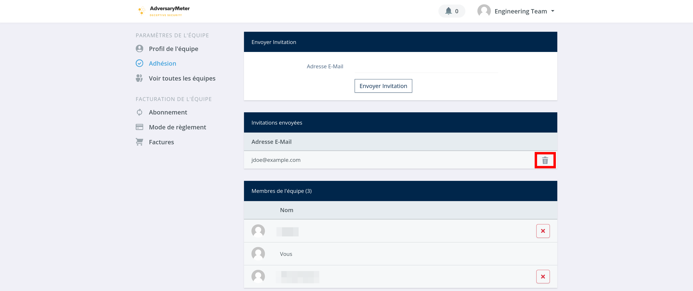

### Suppression d'utilisateur

Pour empêcher un utilisateur d'accéder aux données d'une équipe :

- Ouvrir le menu déroulant situé en haut à droite de l'écran puis sélectionner l'entrée de menu "Vos paramètres"
  
- Dans le menu de gauche, sélectionner l'entrée de menu "Equipes". Sélectionner ensuite l'équipe à laquelle vous
  souhaitez ajouter un utilisateur
  
- Dans le menu de gauche, sélectionner l'entrée de menu "Adhésions"
  
- Dans la liste des "Membres de l'équipe", appuyer sur la croix rouge pour révoquer l'accès aux données de l'équipe à
  l'utilisateur
  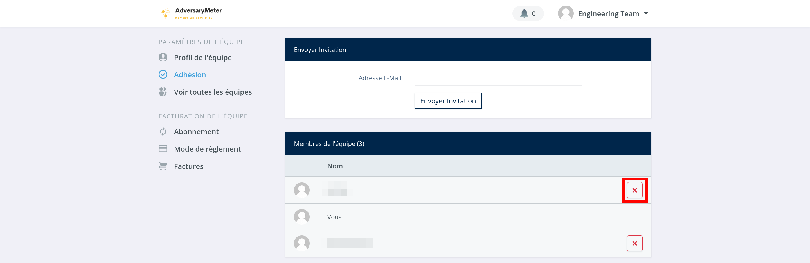

## Actifs

Un _actif_ représente une adresse IP, une plage d'adresses IP ou un DNS vous appartenant. Il est possible d'importer de
nouveaux actifs de trois manières différentes :

- via un ajout manuel
- via une recherche de sous-domaine
- via un import CSV

!!! warning "Bon à savoir..."

    Les actifs ajoutés __ne sont pas__ automatiquement mis sous surveillance! La mise sous surveillance d'un actif est 
    une action à réaliser manuellement.

### Ajout manuel

Pour ajouter manuellement un actif :

- Sélectionner l'onglet "Mes actifs" puis cliquer sur le bouton "+ Ajouter un actif" en haut à droite de l'écran :
  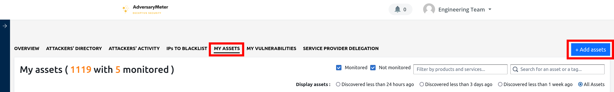
- Dans la liste déroulante, sélectionner l'option "Ajouter un domaine, un sous-domaine ou une adresse IP"
  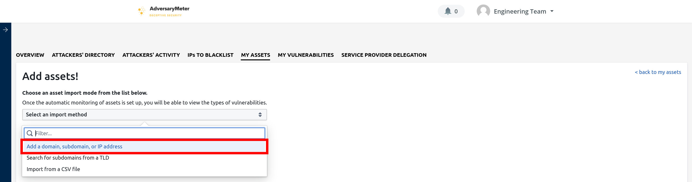
- Saisir le domaine, le sous-domaine ou l'adresses IP que vous souhaitez ajouter à la liste de vos actifs puis cliquer
  sur le bouton "+ Ajouter"
  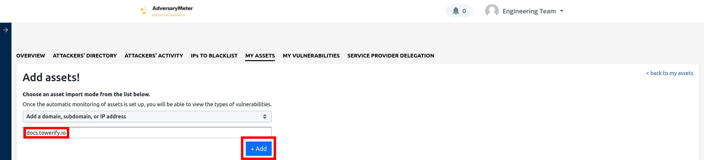
- En cas de succès, une notification s'affiche à l'écran. Il vous est alors possible d'ajouter un autre domaine ou de
  revenir à la liste de vos actifs en cliquant sur le lien "< revenir à mes actifs" en haut à droite de l'écran
  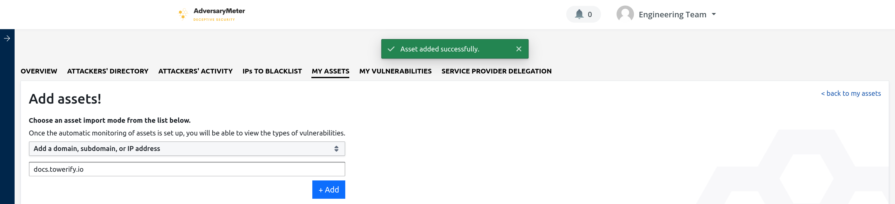
- L'actif ajouter est maintenant visible dans la liste de vos actifs
  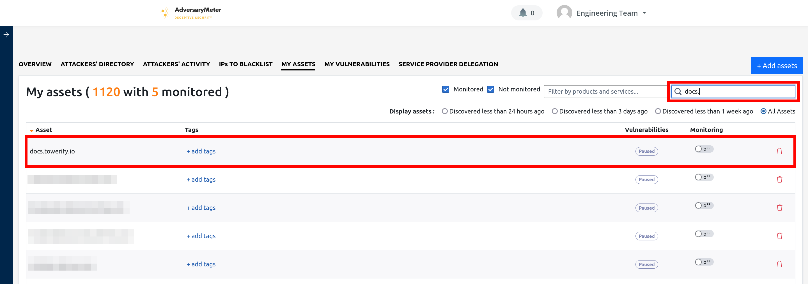

### Recherche de sous-domaine

Pour rechercher un sous-domaine à partir d'un domaine racine :

- Sélectionner l'onglet "Mes actifs" puis cliquer sur le bouton "+ Ajouter un actif" en haut à droite de l'écran :
  
- Dans la liste déroulante, sélectionner l'option "Rechercher des sous-domaines à partir d'un TLD"
  
- Saisir le domaine racine que vous souhaitez énumérer puis cliquer sur le bouton "Rechercher"
  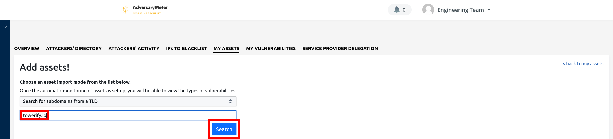
- Après quelques instants de recherche (de 30s à 1mn), une liste de sous-domaines du domaine racine apparaît. Vous
  pouvez alors sélectionner le ou les domaines à importer puis cliquer sur le bouton "+ Ajouter" en bas à droite de
  l'écran pour ajouter ceux-ci à la liste de vos actifs. Si vous souhaitez importer l'ensemble des sous-domaines d'un
  coup, cocher la case située en haut à droite dans l'en-tête du tableau.
  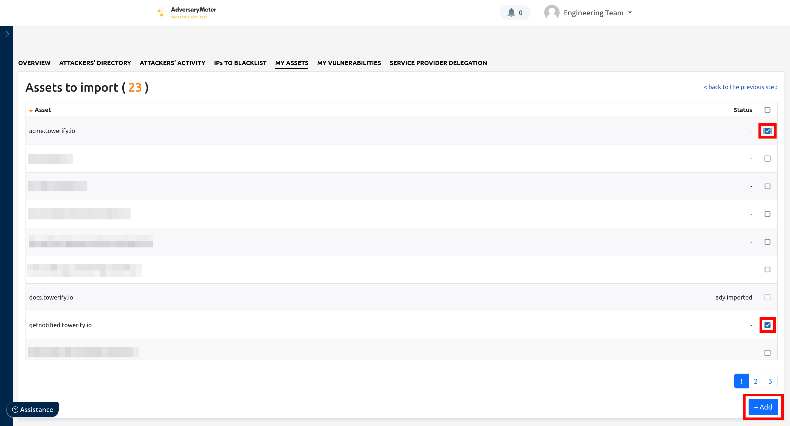
- En cas de succès, vous serez automatiquement redirigé vers la liste de vos actifs. Les actifs ajoutés sont maintenant
  visibles dans cette liste.
  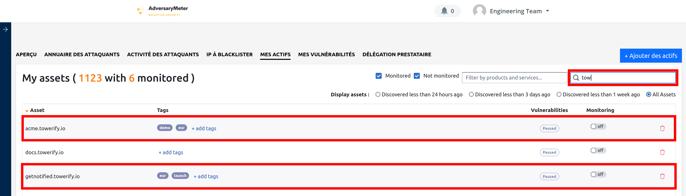

### Import CSV

L'import CSV permet d'importer plusieurs milliers d'actifs d'un coup. De plus, l'import CSV rend possible l'ajout en
masse d'__étiquettes__ :

- Sélectionner l'onglet "Mes actifs" puis cliquer sur le bouton "+ Ajouter un actif" en haut à droite de l'écran :
  
- Dans la liste déroulante, sélectionner l'option "Importer un fichier CSV"
  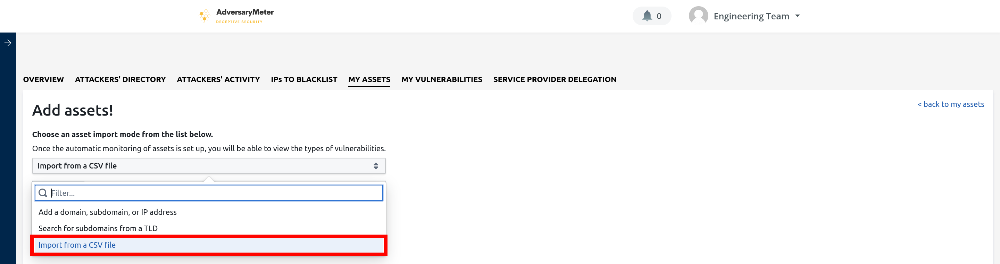
- Vous pouvez ensuite télécharger le modèle de fichier CSV proposé et remplir celui-ci. La première colonne du fichier
  DOIT contenir la liste des domaines, sous-domaines ou adresses IP à importer. La seconde colonne PEUT contenir des
  étiquettes (séparées par un `|`) à ajouter automatiquement aux actifs importés.
  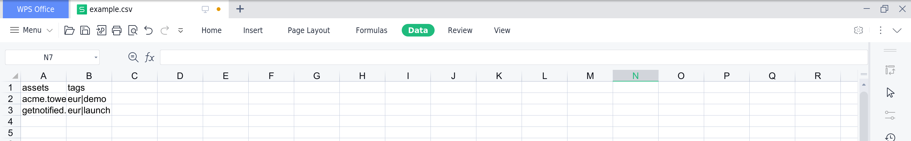
  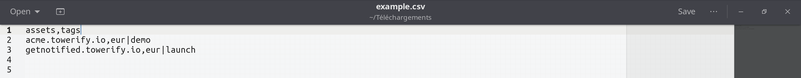
- Une fois le modèle remplit, il ne reste plus qu'à téléverser celui-ci en cliquant sur le bouton "Importer"
  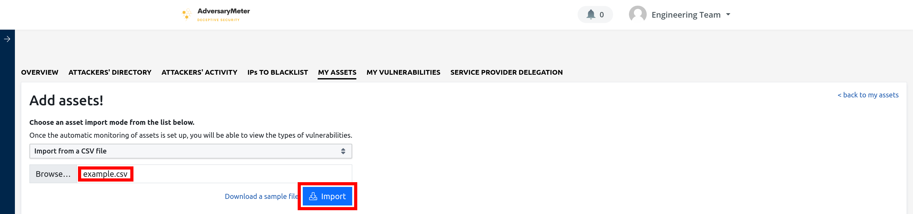
- Une prévisualisation du fichier est alors proposée pour vous permettre d'en vérifier le contenu. Sélectionner
  l'ensemble des actifs en cochant la case située en haut à droite dans l'en-tête du tableau. Cliquer sur le bouton "+
  Ajouter" en bas à droite de l'écran pour lancer le processus d'import.
  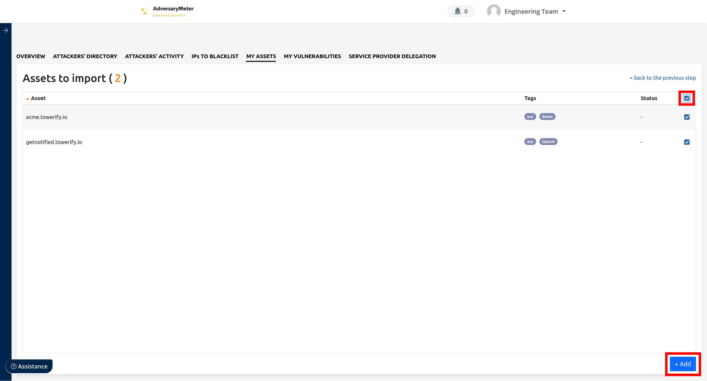
- En cas de succès, vous serez automatiquement redirigé vers la liste de vos actifs. Les actifs ajoutés sont maintenant
  visibles dans cette liste.
  