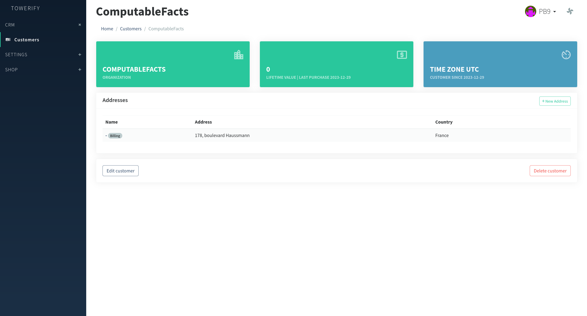
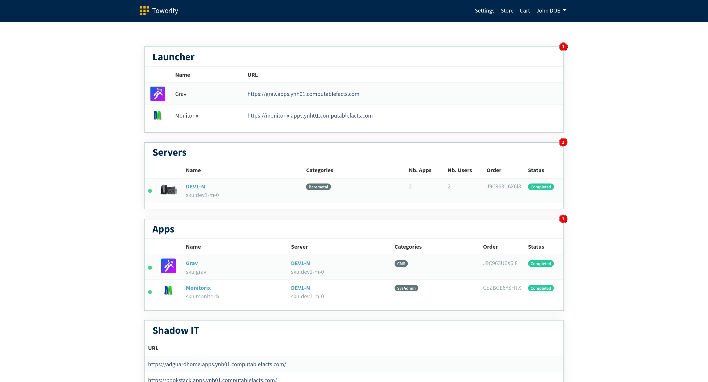
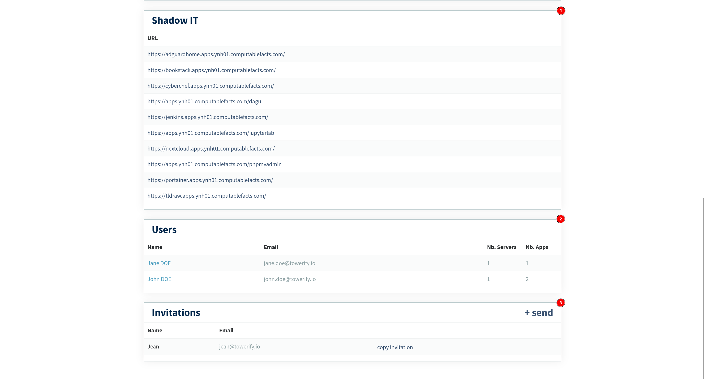

# Fonctionnement

A l'origine, Towerify est né du besoins de déployer un produit en mode SaaS,
[AdversaryMeter](https://adversarymeter.io/), en appliance chez certains de nos clients. Après avoir évalué différentes
solutions du marché (allant de l'utilisation de scripts [Ansible](https://www.ansible.com/)
à [Cloudron](https://www.cloudron.io/) en passant par [Sandstorm](https://sandstorm.io/)) notre choix s'est porté
sur [YunoHost](https://yunohost.org/) pour deux raisons principales: sa configuration par défaut sensée et son
approche "[KISS](https://fr.wikipedia.org/wiki/Principe_KISS)" du packaging d'apps.

Cependant, à l'usage il s'avère que la console d'administration de YunoHost est mal adaptée à un contexte d'entreprise
où l'administration des différents composants techniques (provisionnement de l'infrastructure, gestion des utilisateurs,
déploiement des applications, etc.) est souvent réalisée par des personnes ou des équipes différentes.

Après avoir évalué nos besoins (par exemple la capacité à gérer un catalogue de serveurs ou encore la possibilité
d'administrer de manière centralisée plusieurs instances YunoHost), nous avons jugé préférable de développer une
nouvelle interface utilisateur plutôt que de forker la console d'administration actuellement mise à disposition
par la communauté YunoHost et de modifier celle-ci.

**Towerify permet donc de simplifier l'installation et l'administration de multiples instances YunoHost**. Il reste à
tout moment possible de déconnecter Towerify des instances administrées sans subir d'interruption de service. Towerify
est donc tout à fait adapté au déploiement et à la maintenance en condition opérationnelle d'applications dans un
environnement [Air Gap](https://en.wikipedia.org/wiki/Air_gap_(networking))!

## Architecture

Cette section donne un aperçu du fonctionnement de Towerify Cloud et de Towerify CLI. Bien que cette vue d'ensemble
contienne des approximations, l'objet est ici de donner une image globale du fonctionnement de Towerify avant de
détailler les différents aspects de l'architecture.

[**Towerify Cloud**](#towerify-cloud) est l'application en charge de la gestion de l'infrastructure: installer YunoHost,
configurer l'instance, déployer des [apps pré-packagées](catalog.md), distribuer des accès aux apps, etc.

[**Towerify CLI**](#towerify-cli) est une ligne de commande permettant de déployer sur une instance YunoHost des
applications hors catalogue, i.e. développées par vos soins, au moyen d'un processus
d'[intégration continue](https://fr.wikipedia.org/wiki/Int%C3%A9gration_continue).

!!! note

    Il n'y a aucune dépendance entre Towerify Cloud et Towerify CLI. L'utilisation de l'un n'implique pas l'utilisation 
    de l'autre.

### Towerify Cloud

Towerify Cloud prend en compte trois catégories d'utilisateurs:

- Les [**administrateurs**](#rle-administrateur) fournissent des serveurs à destination de clients (internes ou
  externes à la structure). Ils ont en charge la maintenance du catalogue de matériels disponibles ainsi que du
  provisionnement de celui-ci quand une commande leur est passée. Ils ont aussi en charge la création d'un compte
  _administrateur restreint_ lorsque de nouveaux clients sont créés.
- Les [**administrateurs restreints**](#rle-administrateur-restreint) ont l'autorité nécessaire chez le client pour
  passer commande de matériel et d'applications. Ils ont en charge le déploiement des applications sur le matériel
  commandé. Ils ont aussi en charge la création et la configuration des comptes nécessaire aux _utilisateurs finaux_
  pour utiliser les apps déployées.
- Les [**utilisateurs finaux**](#rle-basic-end-user) ont les permissions nécessaires pour utiliser les apps déployées
  par l'_administrateur restreint_. Que celles-ci soient pré-packagées ou développées en interne et déployées à l'aide
  de Towerify CLI.

!!! note

    Dans le cas où les apps développées en internes sont déployées à l'aide de Towerify CLI, l'_administrateur restreint_
    n'a aucune action à réaliser pour provisionner différents environnements (DNS de dev/staging/prod, certificats SSL,
    etc.). L'ensemble de ces actions est pris en charge de manière transparente par Towerify CLI.

#### Rôle "Administrateur"

Les possibilités offertes à toute personne possédant le rôle _administrateur_ sont les suivantes:

- **Gestion des clients.** Permet la création de nouveaux clients ainsi que la visualisation du chiffre d'affaire de
  chaque client.
- **Gestion des utilisateurs.** Permet la création d'un compte _administrateur restreint_ lors de l'ajout d'un nouveau
  client.
- **Gestion des produits.** Permet la gestion du catalogue de produits: création de fiches produits possédant un nom,
  une description, des images, un prix, etc.
- **Gestion des commandes.** Permet la gestion du cycle de vie d'une commande: paiement, provisionnement du serveur,
  etc.

-   **Gestion des clients**

    ---

    

-   **Gestion des utilisateurs**

    ---

    

-   **Gestion des produits**

    ---

    

-   **Gestion des commandes**

    ---

    

Une des fonctions les plus importantes de l'*administrateur*, une fois la commande de serveur effectuée par le client, 
consiste à mettre en service celui-ci. Pour ce faire, l'*administrateur* a accès à une interface dédiée lui permettant 
d'associer un serveur de la commande à une adresse IP et de lancer la configuration automatique de celui-ci: 
configuration du DNS, installation de YunoHost, configuration de Fail2ban, désactivation de l'API de YunoHost, etc.

-   **Serveurs à configurer**

    ---

    

-   **Configuration d'un serveur**

    ---

    

#### Rôle "Administrateur Restreint"

Les possibilités offertes à toute personne possédant le rôle _administrateur restreint_ sont les suivantes:

- **Gérer les serveurs.** Permet la commande et la demande de mise en service de nouveaux serveurs auprès de 
  l'*administrateur restreint*.
- **Gérer les applications.** Permet d'ajouter une application à sa bibliothèque et de déployer celle-ci sur un serveur 
  précédemment mis en service.
- **Gérer les utilisateurs finaux.** Permet d'inviter de nouveaux utilisateurs et de distribuer à ceux-ci des accès aux 
  apps déployées.

1. Permet de démarrer une application pour laquelle une permission d'accès a été délivrée à l'utilisateur connecté. 
2. Permet de lister les serveurs commandés ainsi l'état de ceux-ci: en cours de mise en service ou prêt à être utilisé. 
3. Permet de lister les applications disponibles ainsi que l'état de celles-ci: prête à être déployée ou déployée.

1. Permet de lister les applications qui n'ont pas été déployées à l'aide de Towerify Cloud.
2. Permet de lister les utilisateurs ayant accès aux différents serveurs.
3. Permet d'inviter un utilisateur à utiliser une ou plusieurs applications.

#### Rôle "Basic End User"

A venir.

### Towerify CLI

A venir.

## Sauvegardes

A venir.

## Sécurité

A venir.
