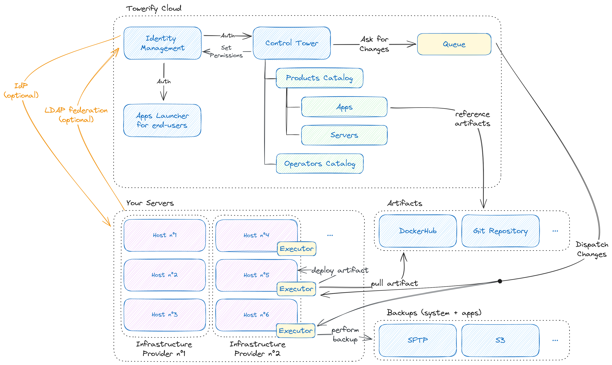

# Aperçu

Cette page fournit une description de haut niveau des fonctionnalités de Towerify Cloud. Bien que cette vue d'ensemble
contienne des approximations, l'objectif est ici de donner une image globale du fonctionnement de Towerify Cloud avant
de détailler les différents aspects de l'architecture.

## Diagramme d'architecture

Vous trouverez ci-dessous un schéma d'architecture illustrant les principaux éléments de la plate-forme Towerify Cloud.

## Aperçu technique

La plate-forme Towerify Cloud est constituée:

- d'une __tour de contrôle__ permettant de déclencher des demandes de changement ;
- d'__hôtes__ étant la cible de ces demandes de changement.

## Une erreur ou une imprécision?

Vous trouvez la documentation de Towerify confuse ou incorrecte? La documentation de Towerify est entièrement open
source! N'hésitez pas à soumettre un `pull request`
sur [GitHub](https://github.com/computablefacts/towerify-docs/tree/develop).