# Workflows

## Gestion des comptes

Cette section décrit le processus de création des comptes utilisateurs dans Towerify Cloud.

Avant de lire cette section, il est conseillé de prendre connaissance de la façon dont les [rôles](personas.md)
permettent aux différents [personas](personas.md) d'un royaume d'agir de concert vers un but commun : s'assurer que les
ressources humaines de ce royaume restent tournées vers l'innovation.

### Création d'un royaume

Un nouveau royaume est automatiquement créé lorsqu'un utilisateur [s'enregistre](https://app.towerify.io/register) pour
la première fois auprès de Towerify Cloud.

Une fois le royaume créé et l'utilisateur connecté, l'ensemble des fonctionnalités offertes par la plateforme deviennent
alors accessibles à cet utilisateur :

- Accès à la bibliothèque d'applications ;
- Déploiement en un clic des applications de la bibliothèque ;
- Invitation de nouveaux utilisateurs ;
- Etc.

Cet utilisateur peut alors organiser son royaume comme il le souhaite : inviter un fournisseur, créer des comptes
opérateurs, etc. La création d'un nouveau compte se fait au moyen de la console d'administration de
Towerify Cloud :


Il suffit alors de déplier la section __settings__ puis de sélectionner l'entrée de menu __users__ pour accéder à la
page de création des comptes :

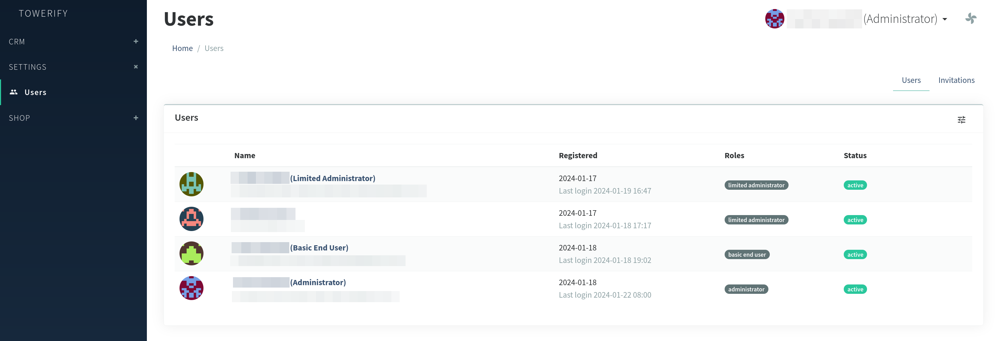

Il est fortement recommandé d'utiliser la fonctionnalité d'__invitation__ des utilisateurs pour créer de nouveaux
comptes :

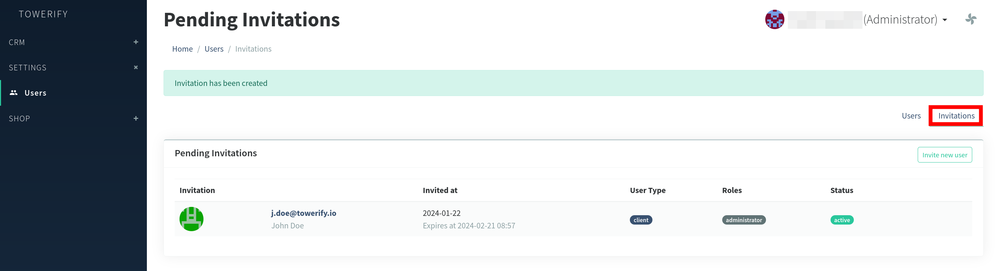

### Création d'un compte Administrateur

Pour créer un compte de type _Administrateur_, cliquez sur l'onglet __invitations__ puis sur le bouton
__invite new user__. Saisissez alors l'email de l'utilisateur, sélectionnez __admin__ comme type d'utilisateur
puis associez le compte au rôle __administrator__ :

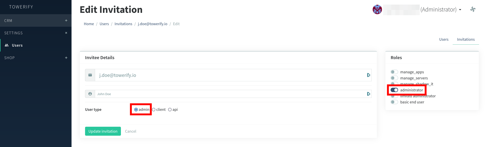

Une invitation sera alors envoyée à l'utilisateur avec un lien de connection à la plateforme.

??? warning "Attention : périmètre de visibilité de l'utilisateur"

    L'utilisateur ainsi créé aura les mêmes droits d'accès que le tenant : il pourra donc à son tour inviter d'autres
    utilisateurs, modifier le catalogue de serveurs ou encore provisionner des hôtes.

### Création d'un compte Administrateur Restreint

Pour créer un compte de type _Administrateur Restreint_, cliquez sur l'onglet __invitations__ puis sur le bouton
__invite new user__. Saisissez alors l'email de l'utilisateur, sélectionnez __client__ comme type d'utilisateur
puis associez le compte au rôle __limited administrator__ :

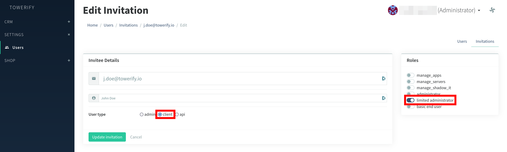

Une invitation sera alors envoyée à l'utilisateur avec un lien de connection à la plateforme.

??? warning "Attention : périmètre de visibilité de l'utilisateur"

    Si vous souhaitez restreindre l'accès de l'utilisateur aux serveurs et applications déployées par une organisation 
    donnée, il vous sera nécessaire d'associer celui-ci à une organisation. Autrement dit, la colonne 
    `users.customer_id` de cet utilisateur devra être associée à une entrée de la table `customers`.

    Un identifiant d'organisation sera __automatiquement__ attribué à l'utilisateur après sa première mise en service
    d'hôte.

### Création d'un compte Utilisateur Final

Les comptes de type _Utilisateur Final_ sont créés par des utilisateurs de type _Administrateur Restreint_. Pour ce
faire, il leur suffit de se connecter à leur espace de travail puis dans la section __invitations__ de cliquer sur le
bouton __+ send__ :

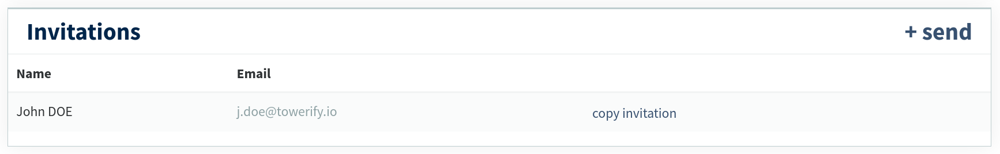

pour être redirigé vers la page de création de compte :

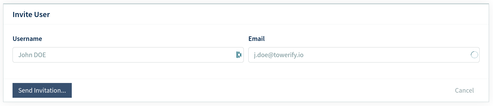

Après saisie de l'email et du nom de l'utilisateur, une invitation lui sera envoyée avec un lien de connection à la
plateforme.

??? warning "Attention : périmètre de visibilité de l'utilisateur"

    Un identifiant d'organisation sera automatiquement attribué à l'utilisateur en se basant sur celui de 
    l'_Administrateur Restreint_ à l'initiative de l'invitation.

??? note "Bon à savoir : Single Sign-On (SSO)"

    Les utilisateurs finaux n'ont pas besoins d'être créés au sein de la plateforme! En effet, si les applications 
    déployées sont compatible SSO la connexion peut se faire de manière transparente au moyen de notre Fédération 
    d'Identité. Pour en savoir plus, contactez-nous. 

    Cependant, si l'utilisateur créé a en charge le développement et le déploiement de nouveaux services sur les hôtes,
    un tel compte s'avérera nécessaire.

## Gestion de l'infrastructure

Cette section décrit le processus de gestion des serveurs mis en oeuvre dans Towerify Cloud.

### Mise à disposition d'un nouveau modèle de serveur

Les _Administrateurs_ ont en charge l'administration des modèles de serveurs pouvant être provisionnés par les
_Administrateurs Restreints_.

Pour ce faire, l'_Administrateur_ doit se rendre dans la section __shop__ de la console d'administration puis cliquer
sur l'entrée de menu __products__. L'_Administrateur_ peut alors créer une nouvelle fiche produit en cliquant sur le 
bouton __new product__ en haut à droite de l'écran :

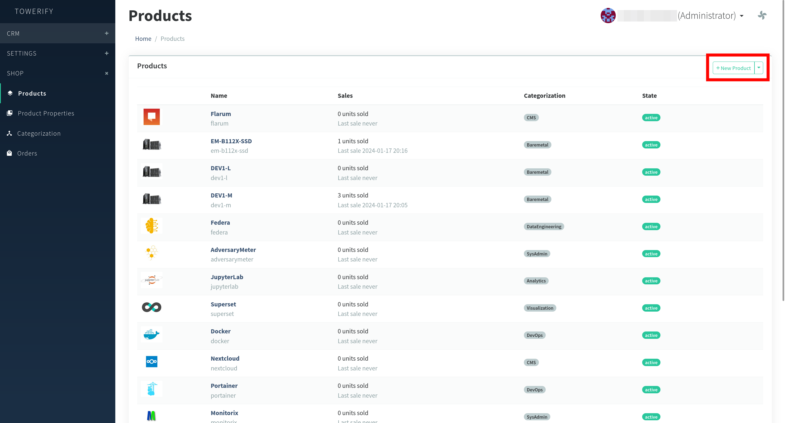

L'_Administrateur_ peut alors associer un __nom__, une __description__ ou encore un __état__ à la fiche produit :

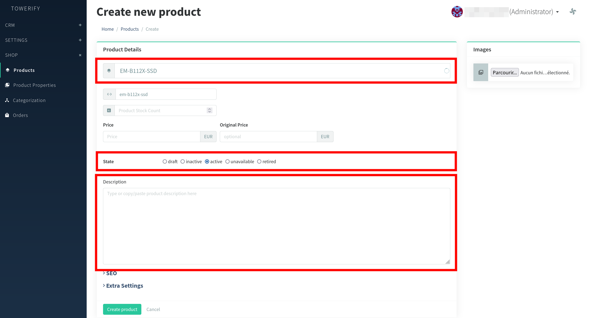

Une fois la fiche produit créée en cliquant sur le bouton __create product__ en bas à gauche de l'écran, il devient
possible d'assigner au serveur une catégorie ainsi que des caractéristiques :

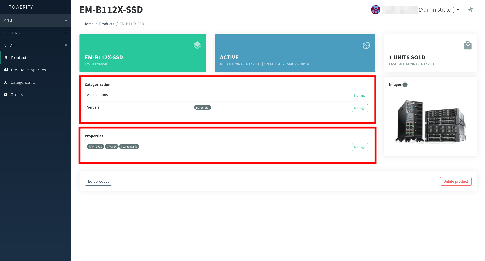

??? note "Bon à savoir : produits de la catégorie applications"

      Bien que les applications proposées par Towerify Cloud soient visibles dans la liste des produits, les fiches 
      produits associées à ces applications ne sont pas éditables par les _Administrateurs_.

Dans le cas où le statut de la fiche produit est __active__, les _Administrateurs Restreints_ ont alors la capacité de 
demander la mise en service de ce modèle de matériel en se rendant dans l'onglet __store__ de leur environnement de 
travail :

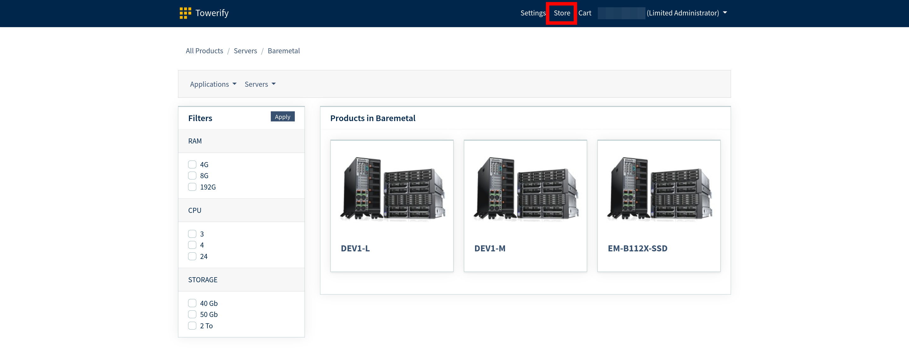

### Mise en service d'un hôte

A venir.

## Mise en place d'un environnement de développement avec Towerify CLI

[Towerify CLI](../cli/) est une ligne de commande permettant l'automatisation de la publication d'applications ad hoc
dans différents environnements.

1. Si vous n'en possédez pas déjà un, instanciez un nouveau serveur à l'aide de Towerify Cloud. Dans la suite, nous
   supposerons que les requêtes HTTP/HTTPS à destination de `*.acme.towerify.io` seront routées vers ce serveur.
   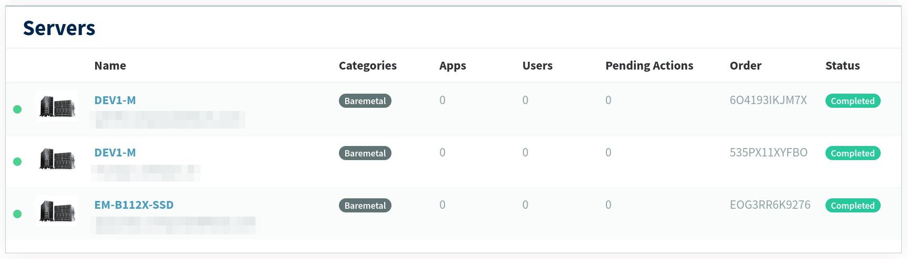
2. Téléchargez et installez Towerify CLI sur votre poste de travail :
   ```console
   $ curl -sL https://cli.towerify.io/install.sh | bash
   
   Towerify CLI est maintenant installé!
   
   Pour configurer votre identifiant et mot de passe, exécutez la commande :
      towerify configure
   ```
3. Vous allez maintenant devoir configurer Towerify CLI pour être en mesure de vous connecter à votre instance :
   ```console
   $ towerify configure
   
   ? Quel est le domaine associé à votre instance Towerify ?
   > acme.towerify.io
   
   ? Quel est votre identifiant Towerify ?
   > john.doe
   
   ? Quel est votre mot de passe Towerify ?
   (Par sécurité, les caractères que vous tapez ne s'afficheront à l'écran)
   >
   ```
   Quand l'opération de configuration se déroule avec succès, le message suivant s'affiche alors à l'écran :
   ```console
   Tentative de connexion à votre instance Towerify... ==> Connexion réussie.
   
   Towerify CLI est maintenant configuré!
   
   Pour déployer une première application, rendez-vous dans le répertoire contenant celle-ci et exécutez la commande :
       towerify init
   ```
   Dans le cas contraire, un message d'erreur s'affiche.
4. Créez un répertoire `hello-world/` et déplacez-vous dans celui-ci :
   ```bash
   $ mkdir hello-world
   $ cd hello-world/
   ```
   Créez ensuite dans ce répertoire un fichier `index.html` dont le contenu est le suivant :
   ```html
   <!DOCTYPE html>
   <html>
       <head>
           <title>Example</title>
       </head>
       <body>
           <p>This is an example of a simple HTML page with one paragraph.</p>
       </body>
   </html>
   ```
5. Vous allez maintenant devoir configurer le processus de déploiement de cette page web :
   ```console
   $ towerify init
   
   ? Choisissez le nom de l'application à déployer ?
   > hello-world
   
   ? Sélectionnez le type d'application à déployer ?
   1) static
   2) laravel-10
   3) laravel-9
   > Votre choix : 1
   ```
   Quand l'opération de configuration se déroule avec succès, le message suivant s'affiche alors à l'écran :
   ```console
   L'application hello-world est prête à être déployée!

   Vous pouvez maintenant déployer celle-ci en exécutant la commande :
       towerify deploy
   ```
   Dans le cas contraire, un message d'erreur s'affiche.
6. Vous êtes maintenant prêt à déployer votre application :
   ```console
   $ towerify deploy
   
   Déploiement de l'application hello-world en cours...
   
   L'application a été déployée en dev avec succès!
   
   Votre application est accessible ici :
       https://dev.hello-world.acme.towerify.io/
   ```
7. Pour terminer, rendez-vous à l'adresse `https://dev.hello-world.acme.towerify.io` à l'aide de votre navigateur.
   Vous devriez y apercevoir la page HTML créée lors de l'étape 4.
