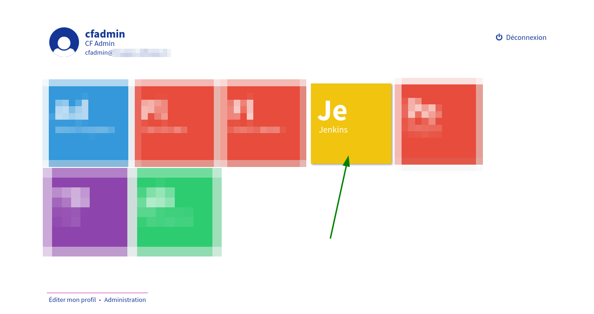
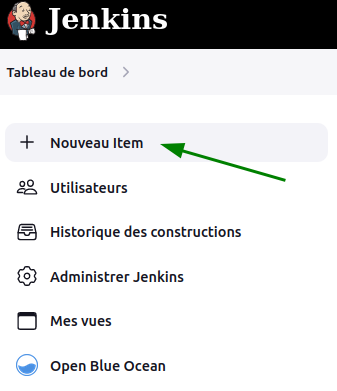
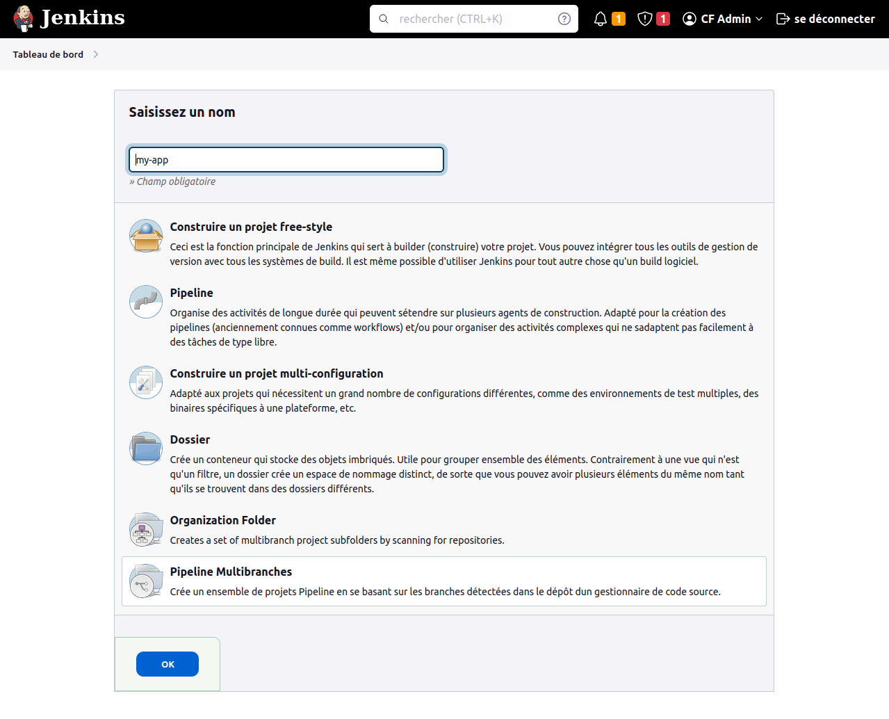
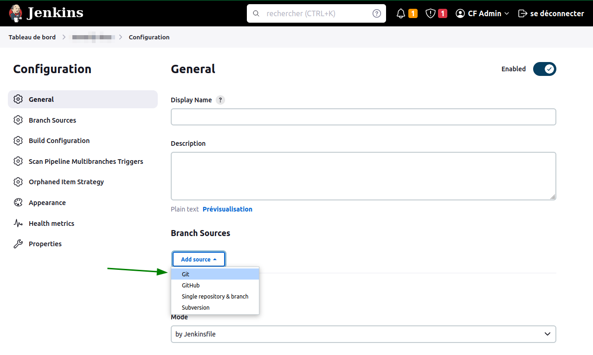
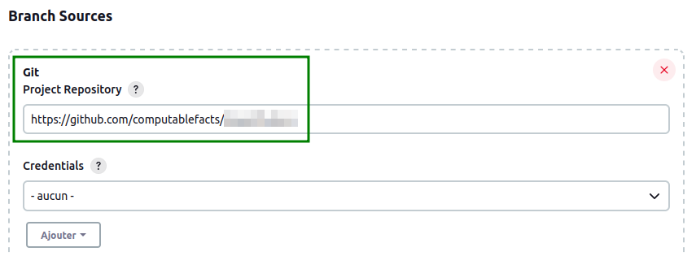
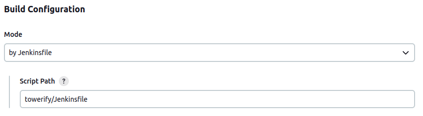
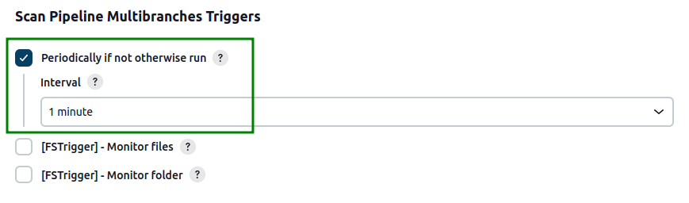

# Application statique


Ce guide vous permet de modifier votre repo Git afin de configurer Towerify.
Nous considerons que votre repo contient une branche principale `main` dont le code correspond
à ce que vous voulez publier en production.

!!! tip

    Si la branche principale de votre repo Git s'appelle `master`, les instructions ci-dessous fonctionnent
    également.


!!! warning "TODO"

    Décrire à part l'utilisation des branches pour 3 envrionnements dev, staging, prod avec, éventuellement,
    l'utilisation de git flow pour les gérer.

## Application statique à déployer

Vous pouvez exécuter les étapes de cette documentation directement dans la repo Git de votre application ou,
si vous préférez, dupliquer notre repo Git exemple.
La suite de cette documentation utilise une copie de notre repo Git exemple.

??? note "TODO : Comment dupliquer notre repo exemple ?"

    Faire un fork. Faire un git clone. Montrer tout ça avec des captures sur GitHub et des lignes de commandes


## Créer le répertoire towerify

``` bash
user@host:~/mon-app-statique
$ mkdir towerify
```


## Ajouter un Dockerfile

Le Dockerfile permet de décrire la façon de votre application sera packagée dans une image Docker.

Créez un fichier `Dockerfile` dans le dossier `towerify` et copiez l'exemple ci-dessous :

``` Dockerfile
FROM nginx

COPY ./src /usr/share/nginx/html
```

!!! note 

    Le `Dockerfile` ci-dessus suppose que les fichiers statiques de votre application se trouvent dans le
    dossier `src` de votre repo Git. Adaptez le nom du dossier si ce n'est pas le cas.


!!! warning "TODO"

    Peut-on faire une commande pour tester le Dockerfile ? Utile ?


## Ajouter un docker-compose.yaml

Le fichier `docker-compose.yaml` décrit la façon dont Towerify va démarrer le container Docker contenant
votre application.

Créez un fichier `docker-compose.yaml` dans le dossier `towerify` et copiez l'exemple ci-dessous :

``` yaml
version: "3"
services:
  myapp:
    image: __DOCKER_IMAGE_NAME__:__DOCKER_IMAGE_TAG__
    ports:
    - target: 80
      host_ip: 127.0.0.1
      published: "__PORT__"
      protocol: tcp
      mode: host
    restart: unless-stopped
``` 

??? note "Towerify remplacera ses variables"

    Vous remarquez que le fichier contient plusieurs variables (`__DOCKER_IMAGE_NAME__`, `__DOCKER_IMAGE_TAG__`,
    `__PORT__`) que Towerify remplacera par leur valeur au moment du déploiement.
    
    Voir [la liste complète des variables possibles](../avances/variables.md).


## Ajouter un Jenkinsfile

Le fichier `Jenkinsfile` décrit le pipeline Jenkins que Towerify va utiliser pour packager puis déployer
votre application.

Créez un fichier `docker-compose.yaml` dans le dossier `towerify` et copiez l'exemple ci-dessous&nbsp;:

``` groovy hl_lines="11-14"
pipeline {
    agent any

    options {
        disableConcurrentBuilds()
        buildDiscarder(logRotator(daysToKeepStr: '90', numToKeepStr: '120'))
    }

    environment {
        /* Variables you must change */
        TOWERIFY_ROOT_DOMAIN = 'customer.towerify.io'
        APP_NAME = 'my-app'
        APP_NAME_SHORT = 'ma' // two characters
        DOCKER_IMAGE_NAME = 'computablefacts/customer-my-app'
        /* DO NOT change below */
        DOCKER_REGISTRY_URL = '' // Leave empty for Docker Hub
        DOCKER_REGISTRY_CRED_ID = 'docker-hub-cf-cred' // credential defined in Jenkins
        DOCKER_IMAGE_TAG = sh(script: "echo twr-${env.BUILD_TAG} | sed -r 's#%2F#_#g'", returnStdout: true).trim()
        TOWERIFY_APP_TEMPLATE_DIR = 'docker_compose_ynh'
    }

    stages {
        stage('Build Docker image') {
            steps {
                script {
                    // Build...
                    dockerImage = docker.build("${env.DOCKER_IMAGE_NAME}", './towerify/Dockerfile')
                    // .. and push to Docker Hub
                    docker.withRegistry("${env.DOCKER_REGISTRY_URL}", "${env.DOCKER_REGISTRY_CRED_ID}") {
                        dockerImage.push("${env.DOCKER_IMAGE_TAG}")
                    }
                }
            }
        }

        stage('Prepare Towerify App template') {
            steps {
                script {
                    TOWERIFY_PATH = ''
                    TOWERIFY_APP_ID_SUFFIX = ''
                    DEPLOY_CPU_RESERVE = '0.1'
                    DEPLOY_CPU_LIMIT = '1'
                    DEPLOY_MEM_RESERVE = '300M'
                    DEPLOY_MEM_LIMIT = '300M'
                    if (env.GIT_BRANCH =~ /develop/) {
                        APP_ENV = 'dev'
                        TOWERIFY_APP_ID = "${APP_NAME}_${APP_ENV}"
                        TOWERIFY_PATH = 'dev'
                    } else if (env.GIT_BRANCH =~ /release/ || env.GIT_BRANCH =~ /hotfix/) {
                        APP_ENV = 'staging'
                        TOWERIFY_APP_ID = "${APP_NAME}_${APP_ENV}"
                        TOWERIFY_PATH = 'staging'
                    } else if (env.GIT_BRANCH =~ /main/ || env.GIT_BRANCH =~ /master/) {
                        APP_ENV = 'prod'
                        TOWERIFY_APP_ID = "${APP_NAME}_${APP_ENV}"
                        TOWERIFY_PATH = 'prod'
                    }

                    TOWERIFY_DOMAIN = "${TOWERIFY_ROOT_DOMAIN}"
                    ENV_DOCKER_TAG = "${APP_ENV}-latest"
                    TOWERIFY_APP_NOT_INSTALLED = sh(script: "sudo yunohost app list | grep ${TOWERIFY_APP_ID}", returnStatus: true)

                    print "APP_ENV=${APP_ENV}"
                    print "TOWERIFY_APP_ID=${TOWERIFY_APP_ID}"
                    print "TOWERIFY_APP_NOT_INSTALLED=${TOWERIFY_APP_NOT_INSTALLED}"
                    print "TOWERIFY_DOMAIN=${TOWERIFY_DOMAIN}"
                    print "TOWERIFY_PATH=${TOWERIFY_PATH}"
                    print "ENV_DOCKER_TAG=${ENV_DOCKER_TAG}"
                }

                checkout changelog: false, scm: scmGit(branches: [[name: '*/main']], extensions: [[$class: 'RelativeTargetDirectory', relativeTargetDir: "${TOWERIFY_APP_TEMPLATE_DIR}"]], userRemoteConfigs: [[url: 'https://github.com/computablefacts/docker_compose_ynh']])

                dir(TOWERIFY_APP_TEMPLATE_DIR) {
                    sh 'cp ../towerify/docker-compose.yaml ./conf/docker-compose.yaml'
                    sh "./customize.sh --app-id ${TOWERIFY_APP_ID} --name 'CC ${APP_ENV} ${TOWERIFY_PATH}' "
                    sh "sed -ri 's/__DOCKER_IMAGE_NAME__/${DOCKER_IMAGE_NAME}/' ./conf/docker-compose.yaml"
                    sh "sed -ri 's/__DOCKER_IMAGE_TAG__/${DOCKER_IMAGE_TAG}/' ./conf/docker-compose.yaml"
                    sh "sed -ri 's/__DEPLOY_CPU_RESERVE__/${DEPLOY_CPU_RESERVE}/' ./conf/docker-compose.yaml"
                    sh "sed -ri 's/__DEPLOY_CPU_LIMIT__/${DEPLOY_CPU_LIMIT}/' ./conf/docker-compose.yaml"
                    sh "sed -ri 's/__DEPLOY_MEM_RESERVE__/${DEPLOY_MEM_RESERVE}/' ./conf/docker-compose.yaml"
                    sh "sed -ri 's/__DEPLOY_MEM_LIMIT__/${DEPLOY_MEM_LIMIT}/' ./conf/docker-compose.yaml"
                }
            }
        }

        stage('Towerify Publish') {
            steps {
                script {
                    docker.withRegistry("${env.DOCKER_REGISTRY_URL}", "${env.DOCKER_REGISTRY_CRED_ID}") {
                        dockerImage.push("${ENV_DOCKER_TAG}")
                    }
                }
                dir(TOWERIFY_APP_TEMPLATE_DIR) {
                    script {
                        if (TOWERIFY_APP_NOT_INSTALLED == 1) {
                            sh "sudo yunohost app install . --force --args=\"domain=${TOWERIFY_DOMAIN}&path=/${APP_NAME}/${TOWERIFY_PATH}&init_main_permission=visitors\" "
                        } else {
                            sh "sudo yunohost app upgrade ${TOWERIFY_APP_ID} --file . --force --no-safety-backup"
                        }
                    }
                }
            }
        }

        stage('END') {
            steps {
                script {
                    echo 'Pipeline terminated'
                }
            }
        }
    }
}
```

Vous devez adapter les variables définies au début du Jenkinsfile à votre application :

`TOWERIFY_ROOT_DOMAIN`

:   Le nom de domaine que nous vous avons attribuer pour votre instance de Towerify.
    Votre nom de client suivi de `towerify.io` par défaut.

`APP_NAME`

:   Le nom de votre application. Ce nom servira à générer l'URL pour votre application donc vous ne devez
    utiliser que les caractères `a-z0-9_-`.

`APP_NAME_SHORT`

:   Un nom court pour votre application. Ce nom apparaîtra dans les tuiles de la page d'accueil de Towerify
    avec lesquelles vous pourrez accéder à votre application.

`DOCKER_IMAGE_NAME`

:   Le nom de l'image Docker. Par défaut elle est stockée sur notre Docker Hub, elle doit être de la 
    forme `computablefacts/<client>-<app_name>`.


## Pousser les modifications

Committez les 3 fichiers du répertoire `towerify` puis pousser le commit vers votre repo Git.


## Configurer Jenkins

Connectez-vous à votre instance de Towerify puis allez dans Jenkins.



Créez un nouveau job dans Jenkins en cliquant sur "Nouveau Item".



Donnez lui un nom, celui de votre application, et choisissez le type "Pipeline Multibranches".




Ajoutez votre repo Git comme source du Job Jenkins en choisissant "Add source > Git".



Définissez l'URL de votre repo Git.




!!! warning "TODO"

    Et si ma repo Git n'est pas publique ?


Plus bas, dans "Build Configuration", modifier l'emplacement du fichier `Jenkinsfile` afin
d'utiliser celui que vous avez créé ci-dessus dans le répertoire `towerify`.



Puis dans "Scan Pipeline Multibranches Triggers", cochez "Periodically if not otherwise run" 
et choisissez un intervalle de 1 minute.



