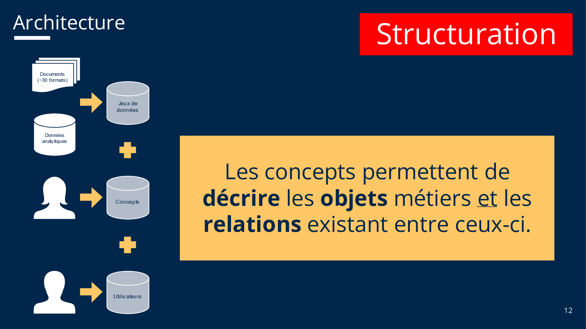
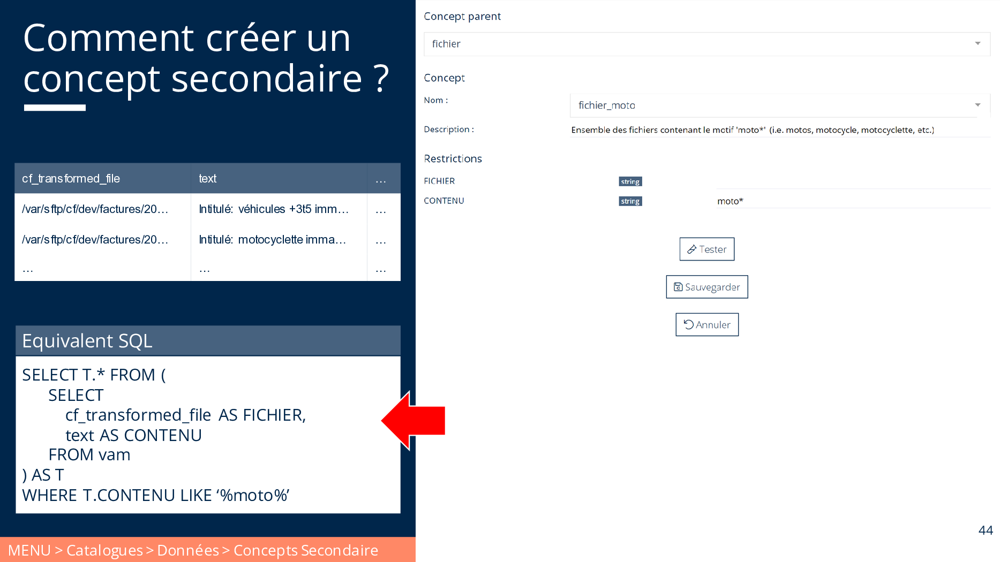
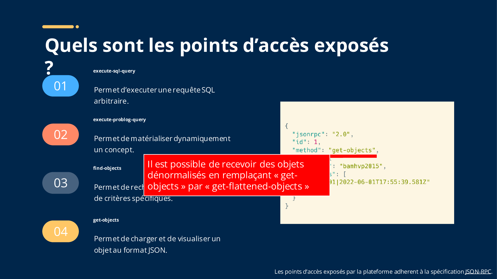

# Support de formation

Cette page est une version web de notre support de formation PDF. Les sujets abordés sont :

- Architecture de la plateforme
- Ecosystème autour de la plateforme

Une documentation au format Markdown est en cours de réalisation.

## Agenda

- [__Architecture.__](#architecture) Comprendre le fonctionnement de la plateforme et le cycle de vies des données :
  capture & stockage, structuration & matérialisation, synthèse et restitution.
- [__Capture & Stockage.__](#capture-stockage) Identifier, acquérir et stocker les données pertinentes issues du
  système d'information de l'organisation.
- [__Structuration.__](#structuration) Mettre en relations les données d'une part et les concepts métiers d'autre part
  afin de fournir à tous les utilisateurs une compréhension unifiée des données.
- [__Synthèse & Visualisation.__](#synthese-visualisation) Répondre à une ou plusieurs questions analytiques précises.
  Agencer et présenter aux utilisateurs l’information.

## Architecture

## Capture & Stockage

### Quels sont les différents types d’habilitations ?

### Quels sont les formats de fichiers pris en charge ?

### Comment créer un jeu de données ?

### Comment surveiller les fichiers en cours d'intégration ?

### Comment visualiser les erreurs d’intégration ?

### Comment accéder à un jeu de données ?

### Comment échantilloner un jeu de données ?

### Comment rechercher dans un jeu de données ?

### Comment restreindre l'accès à certains attributs d'un jeu de données ?

### Comment restreindre l'accès à certaines lignes d'un jeu de données ?

## Structuration

### Qu’est-ce qu’un concept ?

### Quels sont les différents types de concepts ?

### Comment créer un concept primaire ?

### Comment créer un concept secondaire ?

### Comment créer un concept déduit ?

### Comment éditer un concept déduit en mode "plein écran" ?

### Comment publier un concept ?

### Comment matérialiser un concept ?

### Comment visualiser les dépendances entre concepts ?

### Comment rechercher un concept ?

## Synthèse & Visualisation

### De quoi est composé notre écosystème numérique ?

### Comment fonctionne Jenkins ?

### Comment fonctionne Superset ?

### Comment fonctionne un Module de type UI ?

### Comment fonctionne un Module de type API ?

### Quels sont les points d’accès exposés ?

### Comment accéder aux données en Javascript ?

### Comment accéder aux données en Python ?

### Comment accéder aux données en Bash ?

### Comment accéder aux données en Powershell ?

### Comment évaluer la « santé » de la plateforme ?

### Comment auditer les actions des utilisateurs ?

