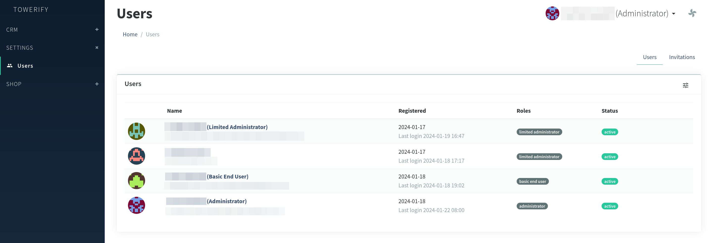

# Gestion des comptes

Cette section décrit le processus de création des comptes utilisateurs dans Towerify Cloud.

Avant de lire cette section, il est conseillé de prendre connaissance de la façon dont les [rôles](personas.md)
permettent aux différents [personas](personas.md) d'un royaume d'agir de concert vers un but commun : s'assurer que les
ressources humaines de ce royaume restent tournées vers l'innovation.

## Création d'un royaume

Un nouveau royaume est automatiquement créé lorsqu'un utilisateur [s'enregistre](https://app.towerify.io/register) pour
la première fois auprès de Towerify Cloud.

Une fois le royaume créé et l'utilisateur connecté, l'ensemble des fonctionnalités offertes par la plateforme deviennent
alors accessibles à cet utilisateur :

- Accès à la bibliothèque d'applications ;
- Déploiement en un clic des applications de la bibliothèque ;
- Invitation de nouveaux utilisateurs ;
- Etc.

Cet utilisateur peut alors organiser son royaume comme il le souhaite : inviter un fournisseur, créer des comptes
opérateurs, etc. La création d'un nouveau compte se fait au moyen de la console d'administration de
Towerify Cloud :

Il suffit alors de déplier la section __settings__ puis de sélectionner l'entrée de menu __users__ pour accéder à la
page de création des comptes :

Il est fortement recommandé d'utiliser la fonctionnalité d'__invitation__ des utilisateurs pour créer de nouveaux
comptes :

## Création d'un compte Administrateur

Pour créer un compte de type _Administrateur_, cliquez sur l'onglet __invitations__ puis sur le bouton
__invite new user__. Saisissez alors l'email de l'utilisateur, sélectionnez __admin__ comme type d'utilisateur
puis associez le compte au rôle __administrator__ :

Une invitation sera alors envoyée à l'utilisateur avec un lien de connection à la plateforme.

??? warning "Attention : périmètre de visibilité de l'utilisateur"

    L'utilisateur ainsi créé aura les mêmes droits d'accès que le tenant : il pourra donc à son tour inviter d'autres
    utilisateurs, modifier le catalogue de serveurs ou encore provisionner des hôtes.

## Création d'un compte Administrateur Restreint

Pour créer un compte de type _Administrateur Restreint_, cliquez sur l'onglet __invitations__ puis sur le bouton
__invite new user__. Saisissez alors l'email de l'utilisateur, sélectionnez __client__ comme type d'utilisateur
puis associez le compte au rôle __limited administrator__ :

Une invitation sera alors envoyée à l'utilisateur avec un lien de connection à la plateforme.

??? warning "Attention : périmètre de visibilité de l'utilisateur"

    Si vous souhaitez restreindre l'accès de l'utilisateur aux serveurs et applications déployées par une organisation 
    donnée, il vous sera nécessaire d'associer celui-ci à une organisation. Autrement dit, la colonne 
    `users.customer_id` de cet utilisateur devra être associée à une entrée de la table `customers`.

    Un identifiant d'organisation sera __automatiquement__ attribué à l'utilisateur après sa première mise en service
    d'hôte.

## Création d'un compte Utilisateur Final

Les comptes de type _Utilisateur Final_ sont créés par des utilisateurs de type _Administrateur Restreint_. Pour ce
faire, il leur suffit de se connecter à leur espace de travail puis dans la section __invitations__ de cliquer sur le
bouton __+ send__ :

pour être redirigé vers la page de création de compte :

Après saisie de l'email et du nom de l'utilisateur, une invitation lui sera envoyée avec un lien de connection à la
plateforme.

??? warning "Attention : périmètre de visibilité de l'utilisateur"

    Un identifiant d'organisation sera automatiquement attribué à l'utilisateur en se basant sur celui de 
    l'_Administrateur Restreint_ à l'initiative de l'invitation.

??? note "Bon à savoir : Single Sign-On (SSO)"

    Les utilisateurs finaux n'ont pas besoins d'être créés au sein de la plateforme! En effet, si les applications 
    déployées sont compatible SSO la connexion peut se faire de manière transparente au moyen de notre Fédération 
    d'Identité. Pour en savoir plus, contactez-nous. 

    Cependant, si l'utilisateur créé a en charge le développement et le déploiement de nouveaux services sur les hôtes,
    un tel compte s'avérera nécessaire.
