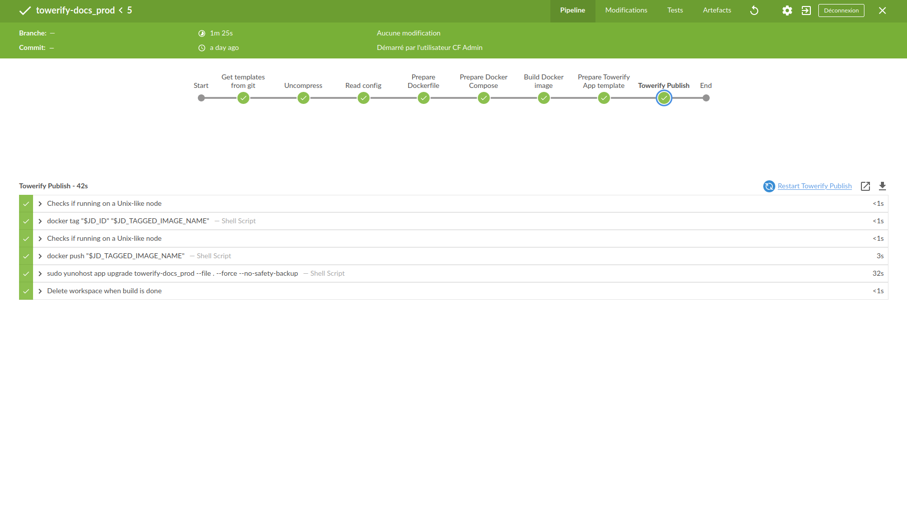
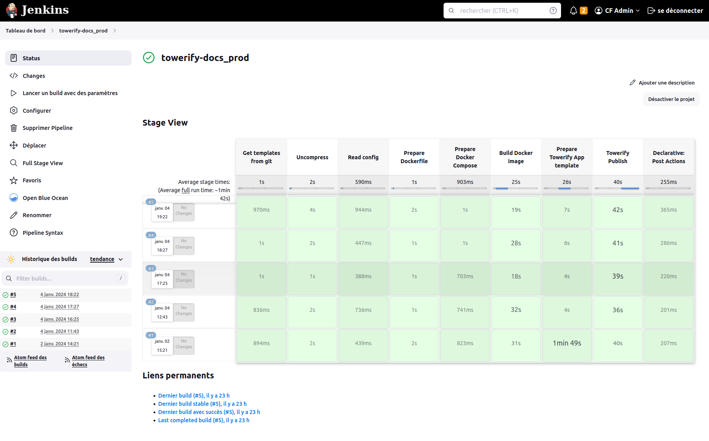

---
search:
exclude: true
--

# Détails sur les application que nous proposons

[Retour au catalogue](../how-it-works.md)

## Jenkins

Jenkins est une [application officielle du catalogue de YunoHost][1]. Mais 
nous avions besoin d'y apporter des modifications spécifiques donc nous avons
décidé de _forker_ le [dépôt GitHub officiel][2] pour y mettre nos changements.

Le packaging de Jenkins que nous déployons se trouve dans la [branche `cf-prod`
de notre dépôt GitHub][3].

Les paragraphes ci-dessous détaillent les modifications que nous y avons 
apportées.

[1]: https://apps.yunohost.org/app/jenkins
[2]: https://github.com/YunoHost-Apps/jenkins_ynh
[3]: https://github.com/computablefacts/jenkins_ynh/tree/cf-prod

### Modifications pour supporter *Towerify CLI*

*Towerify CLI*, notre outil en ligne de commande, qui permet de déployer 
facilement vos applications sur votre *instance Towerify* utilise Jenkins
pour fabriquer l'image Docker puis la déployer.

Pour cela, nous avons eu besoin d'ajouter différents plugins et de faire 
différents paramétrages dans Jenkins.

Nos modifications :

* [X] Ajout du plugin Strict Crumb Issuer
    * Ce plugin est nécessaire pour pouvoir faire des appels à l'API de
      Jenkins 
    * [X] Configurer le plugin : aller dans "Administrer Jenkins" > 
      "Security" > CSRF Protection, choisir "Strict Crumb Issuer", cliquer 
      sur "Avancé" et décocher "Check the session ID"
* [X] Ajout du plugin File Parameter 
    * Ce plugin est nécessaire pour que le pipeline Jenkins puisse 
      accepter un paramètre de type stashedFile qui permet d'envoyer le code
      de l'appplication à déployer dans un fichier compressé.
* [X] Ajout du plugin Pipeline Utility Steps
    * Ce plugin est nécessaire pour que le pipeline Jenkins puisse lire le 
      fichier de configuration écrit en YAML.
* [X] Ajout du plugin Docker Pipeline
    * Ce plugin est nécessaire pour que le pipeline Jenkins puisse utiliser 
      Docker 
    * [X] Donner à Jenkins le droit d'utiliser Docker avec la commande
      `sudo usermod -a -G docker jenkins`. Puis redémarrer Docker avec la 
      commande `sudo systemctl restart docker.service`.
* Donner les droits _sudoer_ à l'utilisateur `jenkins`
    * Nécessaire pour que le pipeline Jenkins puisse executer les commandes
      `sudo yunohost ...`.
    * [X] Ajouter l'utilisateur jenkins aux sudoers avec la commande 
      `sudo sh -c 'echo "jenkins ALL=(ALL) NOPASSWD:ALL" > /etc/sudoers.d/50-jenkins'`
* Jenkins doit être déployé pour le groupe `visitors` pour que les appels à 
  l'API de Jenkins depuis *Towerify CLI* fonctionnent. 
    * [X] Nous avons changé un réglage de sécurité : ne pas laisser un accès
      en lecture seule à Jenkins pour les utilisateurs non connectés.
* Les applications déployées peuvent peser plus de 10Mo
    * [X] Augmenter la taille maximale des uploads autorisés dans la configuration
      `nginx` pour passer cette taille à 100Mo

### Ajout de Blue Ocean

Blue Ocean repense l'expérience utilisateur Jenkins. Conçu dès le départ pour 
les pipelines Jenkins et compatible avec les jobs Freestyle, Blue Ocean augmente
la clarté pour une compréhension rapide et intuitive de l'état du pipeline.

=== "Avec Blue Ocean"

    

=== "Sans Blue Ocean"

    

Nos modifications :

* [X] Ajout du plugin Blue Ocean.
* [ ] Modification de la configuration `nginx` pour rediriger automatiquement vers Blue
  Ocean.

