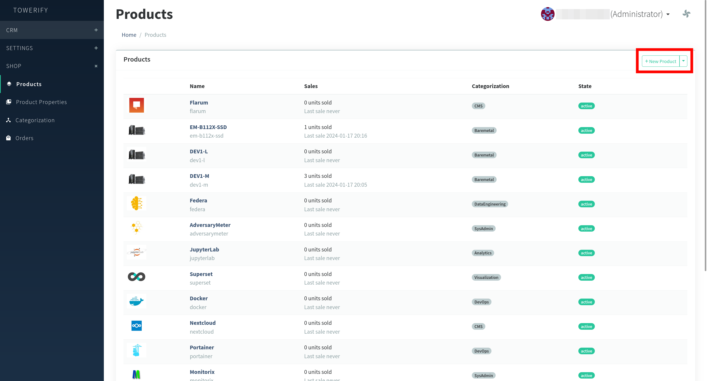
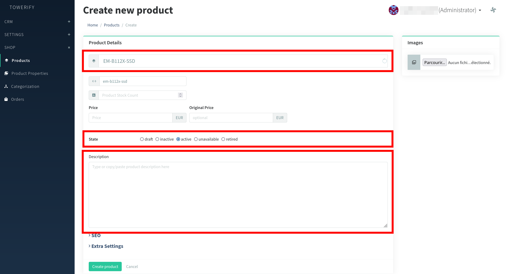
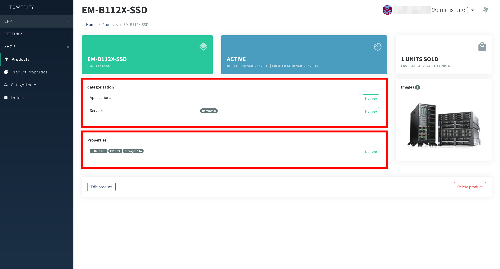
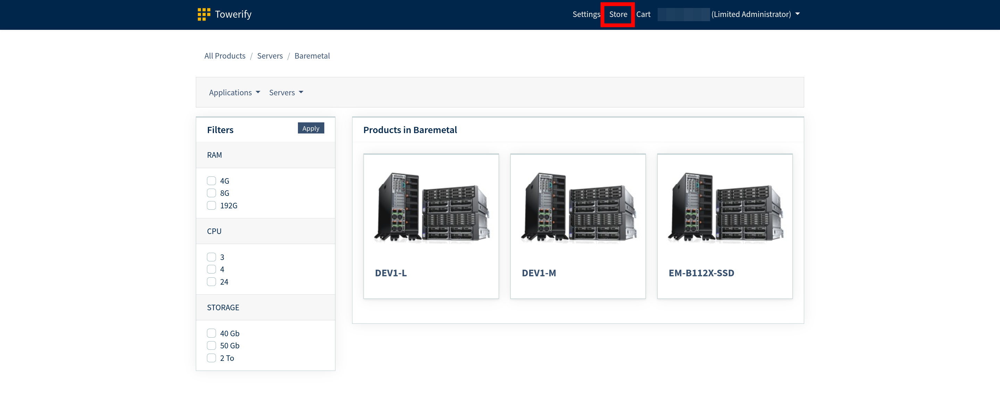
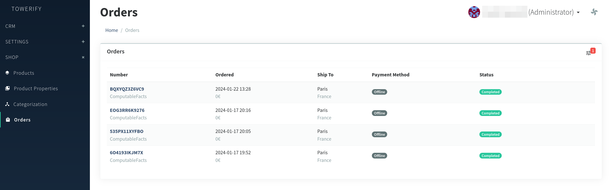
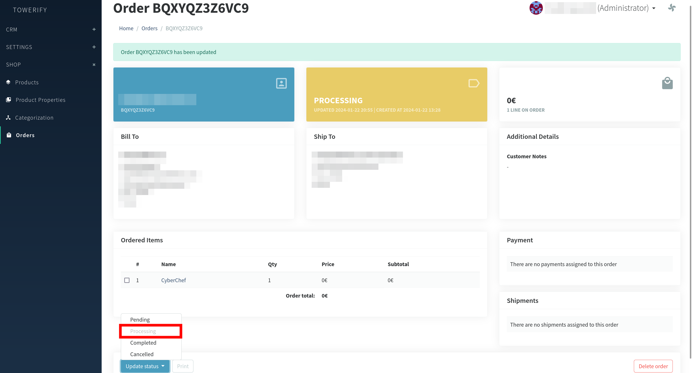
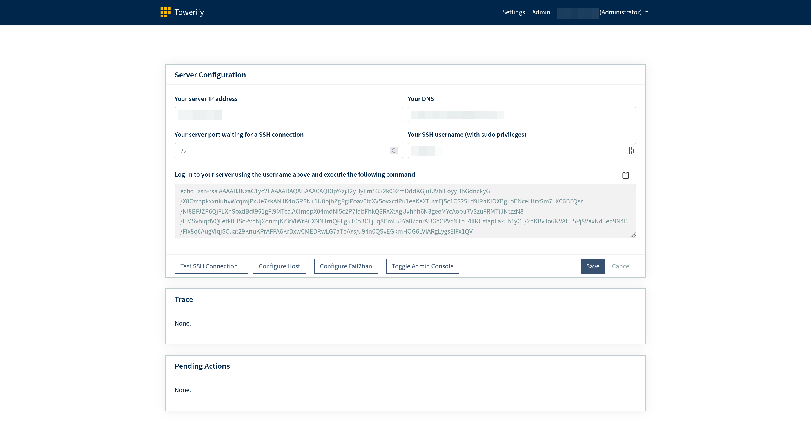
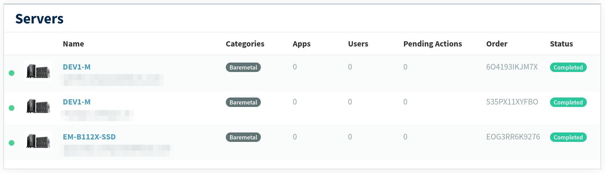

# Gestion de l'infrastructure

Cette section décrit le processus de gestion des serveurs mis en oeuvre dans Towerify Cloud.

## Mise à disposition d'un nouveau modèle de serveur

Les _Administrateurs_ ont en charge l'administration des modèles de serveurs pouvant être provisionnés par les
_Administrateurs Restreints_.

Pour ce faire, l'_Administrateur_ doit se rendre dans la section __shop__ de la console d'administration puis cliquer
sur l'entrée de menu __products__. L'_Administrateur_ peut alors créer une nouvelle fiche produit en cliquant sur le
bouton __new product__ en haut à droite de l'écran :



L'_Administrateur_ peut alors associer un __nom__, une __description__ ou encore un __état__ à la fiche produit :



Une fois la fiche produit créée en cliquant sur le bouton __create product__ en bas à gauche de l'écran, il devient
possible d'assigner au serveur une catégorie ainsi que des caractéristiques :



??? note "Bon à savoir : produits de la catégorie applications"

      Bien que les applications proposées par Towerify Cloud soient visibles dans la liste des produits, les fiches 
      produits associées à ces applications ne sont pas éditables par les _Administrateurs_.

Dans le cas où le statut de la fiche produit est __active__, les _Administrateurs Restreints_ ont alors la capacité de
demander la mise en service de ce modèle de matériel en se rendant dans l'onglet __store__ de leur environnement de
travail :



## Mise en service d'un hôte

Une demande de mise en service est envoyée à l'_Administrateur_ lorsque qu'un _Administrateur Restreint_ complète le
processus de commande d'un nouveau matériel. L'_Administrateur_ a alors en charge de provisionner ce matériel, notamment
en associant à celui-ci une adresse IP et un DNS. Les demandes de mises en service sont accessibles via l'entrée de menu
__orders__ de la section __shop__ de la console d'administration :



Une fois la demande de mise en service reçue, l'_Administrateur_ passe celle-ci dans le statut __processing__ :



Ce statut permet à l'_Administrateur_ de signaler à l'_Administrateur Restreint_ que sa demande de mise en service a
bien été prise en compte et d'associer une adresse IP et un DNS au matériel commandé :



Une fois la clef SSH ajoutée au matériel, l'_Administrateur_ peut tester la connexion à celui-ci au moyen du bouton
__test ssh connection__. Si la connexion réussit, un message s'affiche à l'écran et l'_Administrateur_ peut alors lancer
la configuration de l'hôte en cliquant sur le bouton __configure host__.

Une fois ces actions réalisées, l'_Administrateur_ passe le statut de la commande à __completed__ pour signaler à
l'_Administrateur Restreint_ le matériel commandé est prêt à être utilisé.

## Mise en place d'un environnement de développement avec Towerify CLI

[Towerify CLI](../cli/index.md) est une ligne de commande permettant l'automatisation de la publication d'applications ad hoc
dans différents environnements.

1. Si vous n'en possédez pas déjà un, instanciez un nouveau serveur à l'aide de Towerify Cloud. Dans la suite, nous
   supposerons que les requêtes HTTP/HTTPS à destination de `*.acme.towerify.io` seront routées vers ce serveur.
   
2. Téléchargez et installez Towerify CLI sur votre poste de travail :
   ```console
   $ curl -sL https://cli.towerify.io/install.sh | bash
   
   Towerify CLI est maintenant installé!
   
   Pour configurer votre identifiant et mot de passe, exécutez la commande :
      towerify configure
   ```
3. Vous allez maintenant devoir configurer Towerify CLI pour être en mesure de vous connecter à votre instance :
   ```console
   $ towerify configure
   
   ? Quel est le domaine associé à votre instance Towerify ?
   > acme.towerify.io
   
   ? Quel est votre identifiant Towerify ?
   > john.doe
   
   ? Quel est votre mot de passe Towerify ?
   (Par sécurité, les caractères que vous tapez ne s'afficheront à l'écran)
   >
   ```
   Quand l'opération de configuration se déroule avec succès, le message suivant s'affiche alors à l'écran :
   ```console
   Tentative de connexion à votre instance Towerify... ==> Connexion réussie.
   
   Towerify CLI est maintenant configuré!
   
   Pour déployer une première application, rendez-vous dans le répertoire contenant celle-ci et exécutez la commande :
       towerify init
   ```
   Dans le cas contraire, un message d'erreur s'affiche.
4. Créez un répertoire `hello-world/` et déplacez-vous dans celui-ci :
   ```bash
   $ mkdir hello-world
   $ cd hello-world/
   ```
   Créez ensuite dans ce répertoire un fichier `index.html` dont le contenu est le suivant :
   ```html
   <!DOCTYPE html>
   <html>
       <head>
           <title>Example</title>
       </head>
       <body>
           <p>This is an example of a simple HTML page with one paragraph.</p>
       </body>
   </html>
   ```
5. Vous allez maintenant devoir configurer le processus de déploiement de cette page web :
   ```console
   $ towerify init
   
   ? Choisissez le nom de l'application à déployer ?
   > hello-world
   
   ? Sélectionnez le type d'application à déployer ?
   1) static
   2) laravel-10
   3) laravel-9
   > Votre choix : 1
   ```
   Quand l'opération de configuration se déroule avec succès, le message suivant s'affiche alors à l'écran :
   ```console
   L'application hello-world est prête à être déployée!

   Vous pouvez maintenant déployer celle-ci en exécutant la commande :
       towerify deploy
   ```
   Dans le cas contraire, un message d'erreur s'affiche.
6. Vous êtes maintenant prêt à déployer votre application :
   ```console
   $ towerify deploy
   
   Déploiement de l'application hello-world en cours...
   
   L'application a été déployée en dev avec succès!
   
   Votre application est accessible ici :
       https://dev.hello-world.acme.towerify.io/
   ```
7. Pour terminer, rendez-vous à l'adresse `https://dev.hello-world.acme.towerify.io` à l'aide de votre navigateur.
   Vous devriez y apercevoir la page HTML créée lors de l'étape 4.
