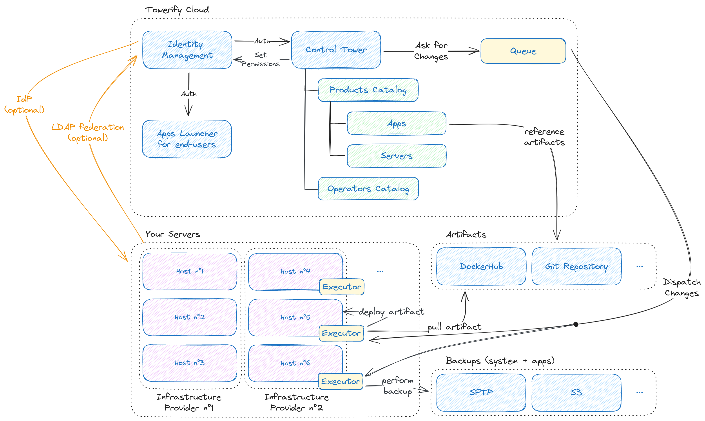

# Aperçu

Cette page fournit une description de haut niveau des fonctionnalités de Towerify Cloud. Bien que cette vue d'ensemble
contienne des approximations, l'objectif est ici de donner une image globale du fonctionnement de Towerify Cloud avant
de détailler les différents aspects de l'architecture.

## Diagramme d'architecture

Vous trouverez ci-dessous un schéma d'architecture illustrant les principaux éléments de la plate-forme Towerify Cloud.

## Aperçu technique

La plate-forme Towerify Cloud est constituée:

- d'une __tour de contrôle__ permettant de déclencher des demandes de changement ;
- d'__hôtes__ étant la cible de ces demandes de changement.

## Changements d'adresses IP

Afin de provisionner et de communiquer avec vos hôtes, Towerify Cloud a besoin d'un accès SSH à ces derniers. Si vous
avez configuré vos serveurs pour restreindre l'accès SSH à l'aide de listes d'autorisations IP, vous devez autoriser les
adresses IP suivantes de Towerify Cloud:

- `51.15.140.162`
- `217.70.184.38`

Vous pouvez également accéder aux adresses IP via l'URL
suivante: [`https://app.towerify.io/ips-v4.txt`](https://app.towerify.io/ips-v4.txt). Ceci est particulièrement utile si
vous avez l'intention d'automatiser la gestion de votre réseau ou de votre infrastructure.

??? note

    Les adresses IP de Towerify Cloud peuvent changer de temps à autre. Cependant, nous vous enverrons toujours un
    courriel plusieurs semaines avant tout changement d'adresse IP.

## Une erreur ou une imprécision?

Vous trouvez la documentation de Towerify confuse ou incorrecte? La documentation de Towerify est entièrement open
source! N'hésitez pas à soumettre un `pull request`
sur [GitHub](https://github.com/computablefacts/towerify-docs/tree/develop).