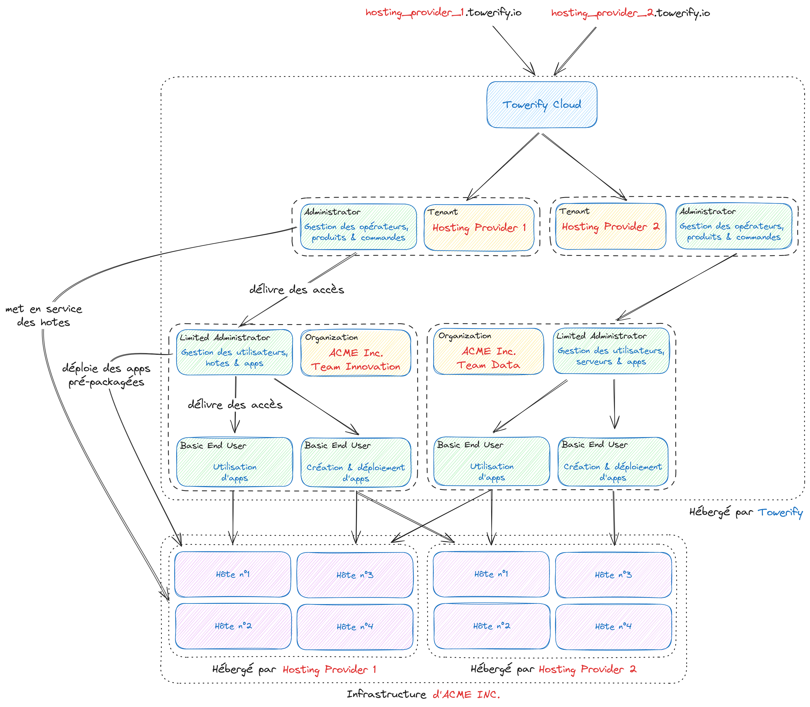

# Personas

Towerify Cloud permet à différentes catégories d'utilisateurs appartenant à un même __royaume__ (i.e. ensemble
d'équipes, d'organisations, etc.) d'agir de concert vers un but commun : s'assurer que les ressources humaines de ce
royaume restent tournées vers l'innovation.

Towerify Cloud étant une plateforme [multi-tenant](https://en.wikipedia.org/wiki/Multitenancy), chaque royaume est créé
et administré par un "super-administrateur" différent. Par défaut, un royaume est configuré pour tenir compte des
personas décrits ci-après :

- Les __fournisseurs__ d'infrastructure ont en charge de provisionner des hôtes ;
- Les __opérateurs__ ont en charge de déployer des applications sur ces hôtes ;
- Les __utilisateurs__ accèdent aux applications déployées ou développent de nouveaux services à déployer sur ces hôtes.

Le système de permissions et de rôles utilisé par Towerify Cloud étant extrêmement flexible, il est tout à fait
envisageable de modéliser d'autres personas que ceux décrits ci-après.

## William, le fournisseur

Les __fournisseurs__ d'infrastructure sont des personnes, équipes ou organisations en charge de provisionner de
l'infrastructure. Leur périmètre fonctionnel comprend notamment :

- La mise à disposition et la maintenance d'un catalogue de produits i.e. serveurs ;
- Le provisionnement des produits commandés i.e. l'attribution d'une IP à une machine ou encore l'association de cette
  IP à un DNS ;
- La mise en service des hôtes ;
- La création de comptes opérateurs permettant le déploiement d'applications sur des hôtes.

Ce persona correspond au rôle __Administrator__.

??? note "Bon à savoir : accès aux serveurs..."

    Une fois l'hôte mis en service, le fournisseur d'infrastructure n'a plus accès à celui-ci. Cependant, Towerify Cloud
    permet de fournir un accès direct à un hôte en cas de nécessité ou dans le cadre d'un processus de réversibilité.

## Marie, l'opérateur

Les __opérateurs__ sont des personnes ou équipes en charge de déployer des applications sur des hôtes. Leur périmètre
fonctionnel comprend notamment :

- La commande de matériel auprès de fournisseurs ;
- Le déploiement et la configuration des applications déployées sur les hôtes ;
- La création de comptes utilisateurs permettant d'accéder aux applications déployées.

Ce persona correspond au rôle __Limited Administrator__.

??? note "Bon à savoir : accès aux serveurs..."

    Un opérateur n'a pas d'accès direct aux hôtes provisionnés par le fournisseur d'infrastructure. Cependant, Towerify 
    Cloud permet de fournir un accès direct à un hôte en cas de nécessité ou dans le cadre d'un processus de réversibilité.

## Patrick, l'utilisateur

Les __utilisateurs__ se divisent en deux catégories :

- Les __utilisateurs finaux__ sont des personnes accédant à une ou plusieurs applications dans le cadre de leur activité
  professionnelle ;
- Les __développeurs__ sont des personnes chargées de réaliser des applications ou services. Leur périmètre
  fonctionnel comprend notamment :

    - Le développement d'applications et de services ;
    - Le packaging et le déploiement des applications développées sur un hôte.

Ce persona correspond au rôle __Basic End User__.

??? note "Bon à savoir : accès aux serveurs..."

    Un utilisateur n'a pas d'accès direct aux hôtes mis en service le fournisseur d'infrastructure. Cependant, Towerify 
    Cloud permet de fournir un accès direct à un hôte en cas de nécessité ou dans le cadre d'un processus de réversibilité.

??? note "Bon à savoir : intégration continue..."

    Dans le cas où une application est déployée à l'aide de [Towerify CLI](../cli/), les opérateurs n'ont aucune action à 
    réaliser pour provisionner les DNS de dev/staging/prod, les certificats SSL ou encore la base de données MySQL. 
    L'ensemble de ces actions est pris en charge automatiquement et de façon transparente par Towerify CLI.

??? note "Bon à savoir : Single Sign-On (SSO)"

    Les utilisateurs finaux n'ont pas besoins d'être créés au sein de la plateforme! En effet, si les applications 
    déployées sont compatible SSO la connexion peut se faire de manière transparente au moyen de notre Fédération 
    d'Identité. Pour en savoir plus, contactez-nous.

    Cependant, si l'utilisateur créé a en charge le développement et le déploiement de nouveaux services sur les hôtes, 
    un tel compte s'avérera nécessaire.

## Diagramme d'interactions

Vous trouverez ci-après un schéma donnant un aperçu des principales interactions entre les différents rôles.

